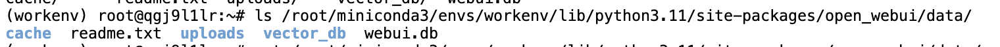
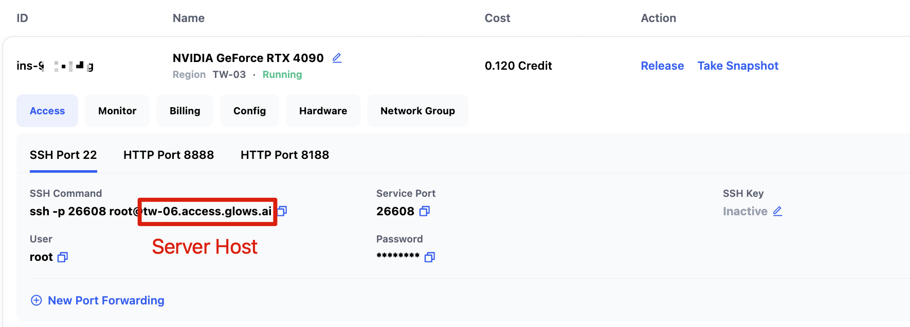
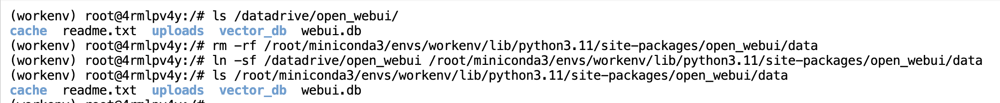
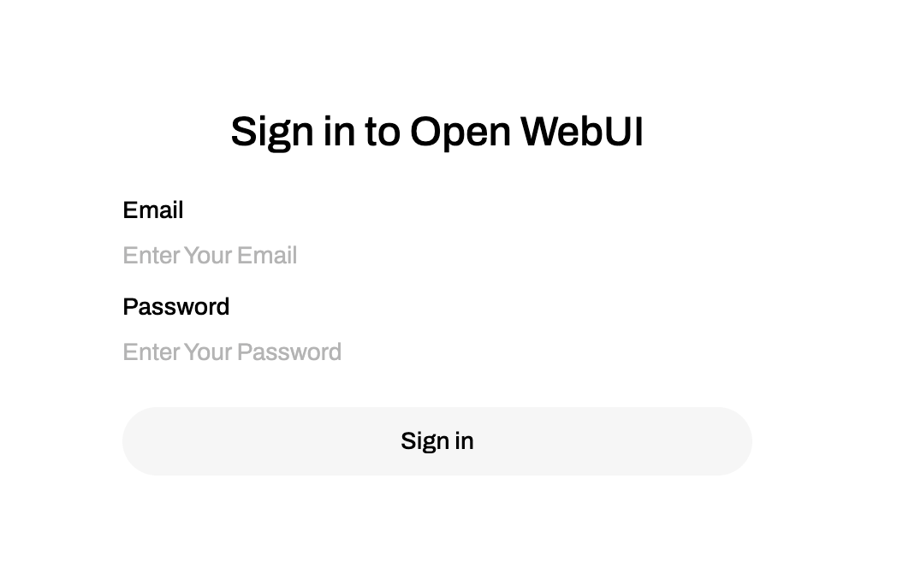

# How to Migrate OpenWebUI Data to Another Glows.ai Instance?

## Exporting the OpenWebUI Database

The project data for OpenWebUI is stored in the `open_webui/data` directory inside the Python third-party packages folder. (If you are not using miniconda or your Python version is not 3.11, the path may be different. Please adjust accordingly.)

```bash
/root/miniconda3/envs/workenv/lib/python3.11/site-packages/open_webui/data
```



You can first copy the data to Glows.ai's /datadrive, for example `/datadrive/open_webui`. Please enter the following commands to copy the files:

```bash
mkdir /datadrive/open_webui
cp -r /root/miniconda3/envs/workenv/lib/python3.11/site-packages/open_webui/data/* /datadrive/open_webui
```

If you did not mount Datadrive when creating the instance, you can use the `scp` command to download the `open_webui/data` folder to your local machine, and then upload it to Glows.ai's Datadrive. Open Terminal or CMD on your local machine and enter:

```bash
scp -P [Service Port] -r root@[Service Host] /root/miniconda3/envs/workenv/lib/python3.11/site-packages/open_webui/data ./

# Example
scp -P 26608 -r root@tw-06.access.glows.ai /root/miniconda3/envs/workenv/lib/python3.11/site-packages/open_webui/data ./
```



## Importing the OpenWebUI Database to Another Instance

If you downloaded the OpenWebUI database to your local machine, please upload the relevant files to the Datadrive of the new instance before proceeding. It is recommended to use the [Datadrive client](https://docs.glows.ai/docs/datadrive-app) to upload the OpenWebUI folder.

When creating the new instance, remember to mount Datadrive. After entering the new instance, execute the following commands:

```bash
# Check if the data exists under Datadrive
# If you don't see the data, you may not have mounted Datadrive when creating the instance, or the directory path is incorrect. Please change /datadrive/open_webui to your actual path.
ls /datadrive/open_webui/
# Delete the original openwebui data folder
rm -rf /root/miniconda3/envs/workenv/lib/python3.11/site-packages/open_webui/data
# Create a symbolic link to point the openwebui data folder to the backup data under datadrive
ln -sf /datadrive/open_webui /root/miniconda3/envs/workenv/lib/python3.11/site-packages/open_webui/data
# Check the contents of the symbolic link
ls /root/miniconda3/envs/workenv/lib/python3.11/site-packages/open_webui/data
cache  readme.txt  uploads  vector_db  webui.db
```



After setting the OpenWebUI database path, you need to restart the OpenWebUI service for the changes to take effect. Please execute the following commands to restart OpenWebUI:

```bash
pkill -f open-webui
nohup /root/miniconda3/envs/workenv/bin/open-webui serve > open_webui.log 2>&1 &
```

Then, reconnect to port 8080 of the new instance, and you can log in with your original account!



---

## Contact Us

If you have any questions or suggestions while using Glows.ai, feel free to contact us via Email, Discord, or Line.

**Glows.ai Email:** support@glows.ai

**Discord:** https://discord.com/invite/glowsai

**Line:** https://lin.ee/fHcoDgG
