# How to Run GPT-OSS-20B and GPT-OSS-120B on Glows.ai

This tutorial will guide you on how to run the latest **gpt-oss-20b** model on Glows.ai using a rented **NVIDIA GeForce RTX 4090** GPU. Using the same method, you can also run the **gpt-oss-120b** model on an **NVIDIA H100 SXM5**.

The tutorial covers the following topics:

- How to create an instance on Glows.ai
- How to use gpt-oss-20b
- Sharing access with others
- Programmatically calling gpt-oss-20b via API
- Using Auto Deploy for “start-on-demand” instances

**GPT-OSS-20B** is an open-source large language model released by OpenAI in August 2025, featuring around 21 billion parameters. It uses a **Mixture-of-Experts (MoE)** architecture, where each token only activates about 3.6 billion parameters, reducing inference resource requirements. The model supports local deployment, with performance optimizations for MoE layers, and runs with only 16GB of GPU memory. According to official benchmarks, its performance is close to **OpenAI o3-mini** on several common tests.

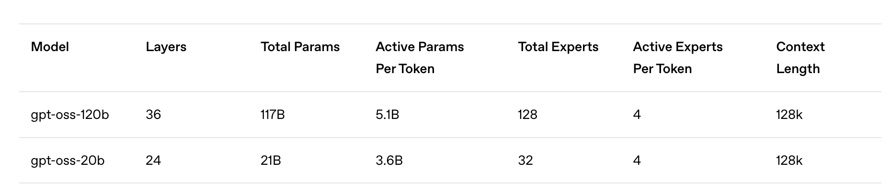

## Creating an Instance

On Glows.ai, create an on-demand instance following [this guide](https:/docs.glows.ai/docs/Create%20New). Make sure to select the official pre-configured **GPT OSS 20B** image (img-neqm8dp2).

On the **Create New** page, set `Workload Type` to **Inference GPU -- 4090** and select the **GPT OSS 20B** image. This image comes with the necessary runtime environment and pre-started services: Ollama (listening on port 11434) and OpenWebUI (listening on port 8080).

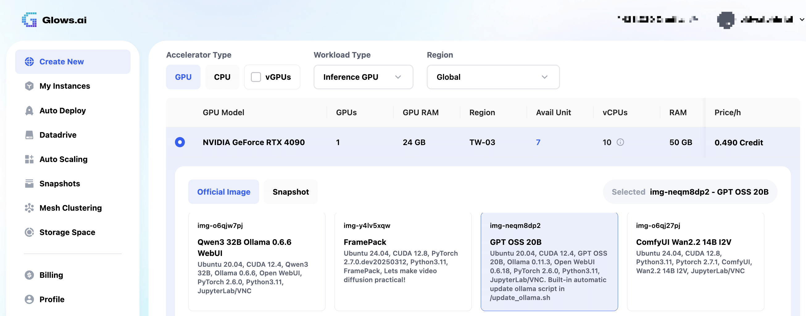

**Datadrive** is Glows.ai’s cloud storage service, allowing you to upload data, models, and code before creating an instance. During instance creation, you can click `Mount` to mount Datadrive, giving direct access from the instance.

This tutorial focuses on inference only, so mounting Datadrive is not required.

After completing the setup, click `Complete Checkout` in the bottom right to create the instance.

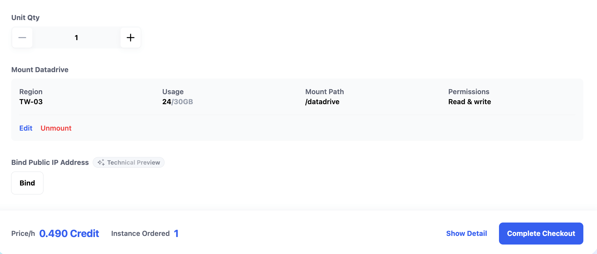

The **GPT OSS 20B** instance takes about 30–60 seconds to start. Once started, you can check its status and access links in `My Instances`:

- **SSH Port 22**: SSH connection
- **HTTP Port 8888**: JupyterLab
- **HTTP Port 11434**: Ollama API
- **HTTP Port 8080**: OpenWebUI

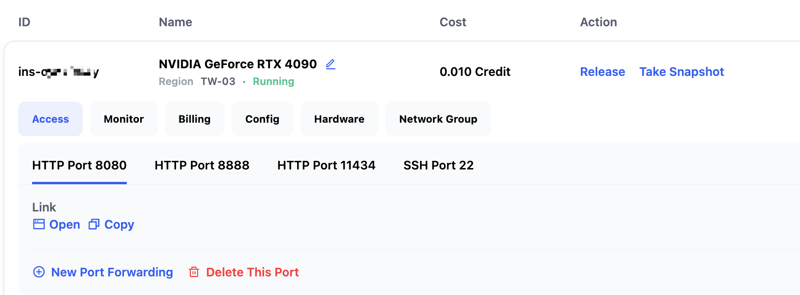

## Using GPT OSS 20B

Go to the `My Instances` page and click the `Open` button under **HTTP Port 8080** to access the **Open WebUI** service. The first time you use it, you’ll need to create an administrator account.

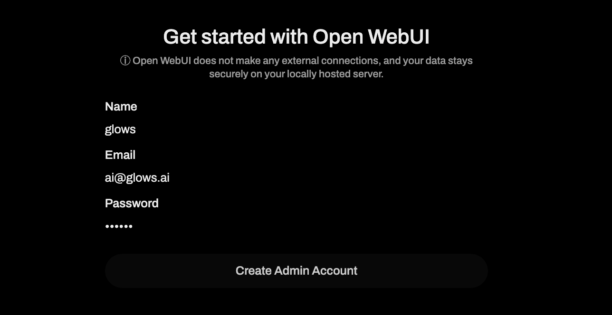

Once the account is created, you’ll enter the chat interface and can interact directly with the **gpt-oss-20b** model.

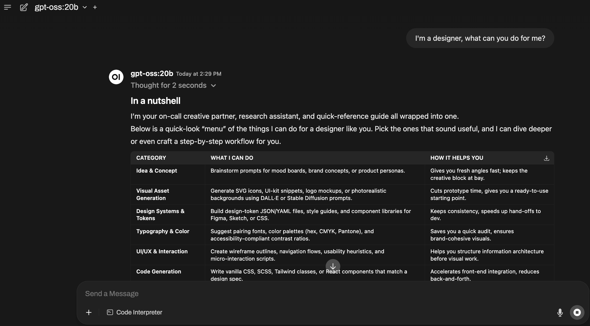

**Open WebUI** also suggests follow-up questions based on the current conversation, making it easier to extend dialogues.

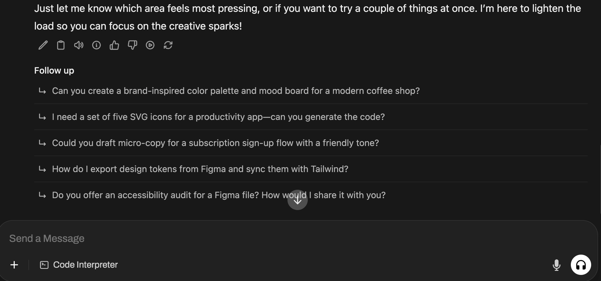

## Sharing with Friends

OpenWebUI has a built-in account management system to isolate conversations. Follow these steps: click the top-left menu → bottom-left avatar → **`Admin Panel`**.

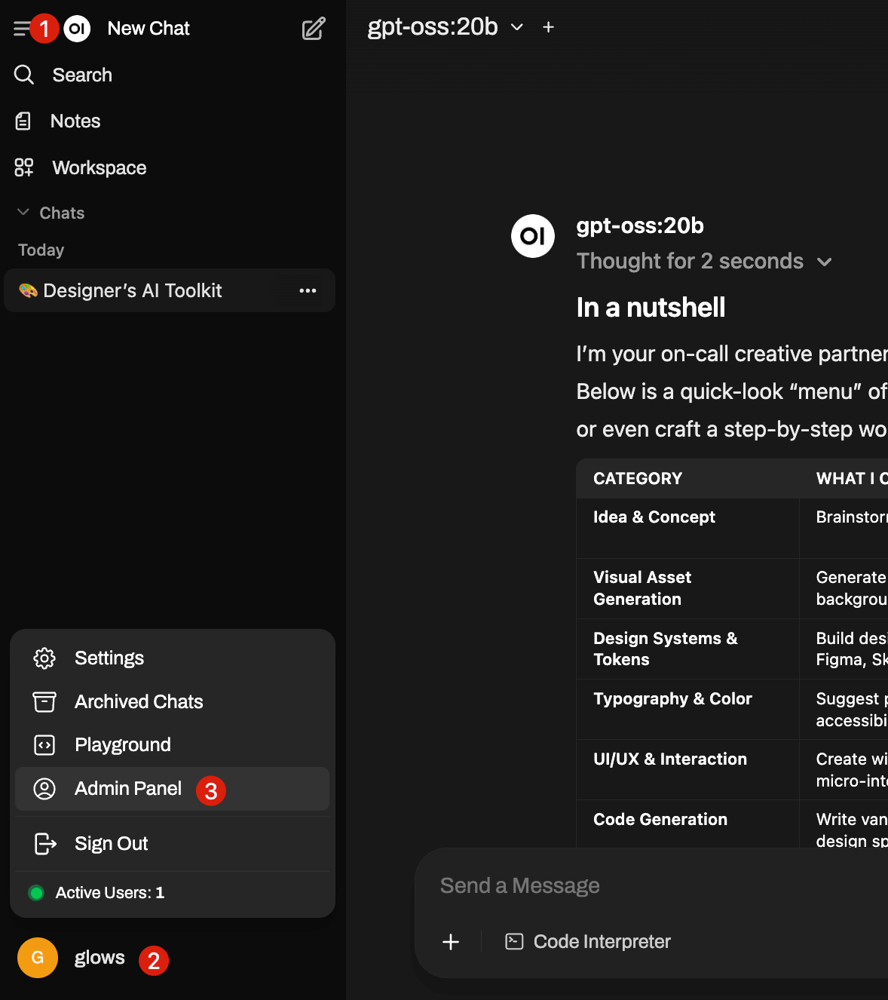

Click `Settings`, set **Default User Role** to `user`, enable **New Sign Ups**, and click `Save`.

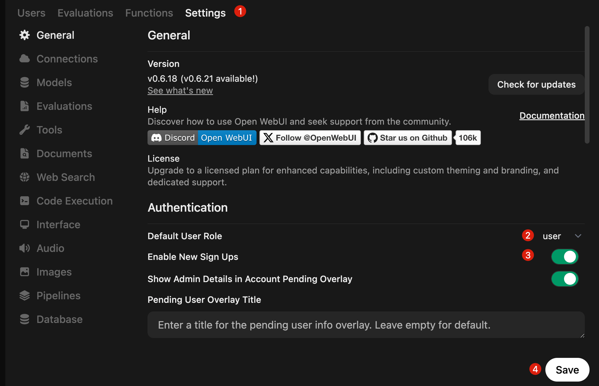

Share the **HTTP Port 8080** link from `My Instances` with friends. They can open it in a browser and click `Sign up` to create a new account.

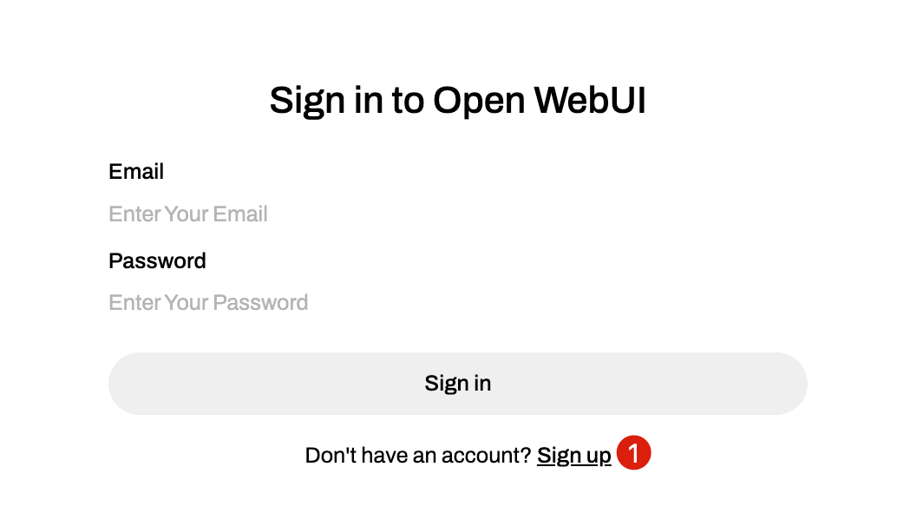

After users register, the admin can view their accounts and question history in the **`Admin Panel`**.

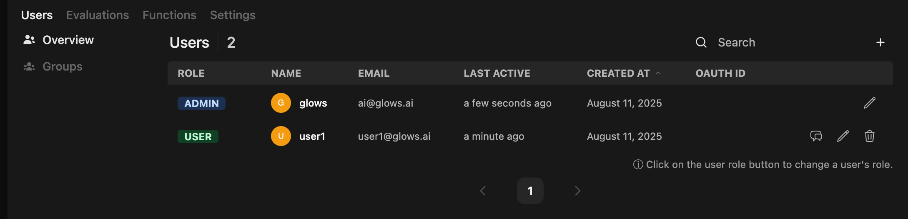

## Calling GPT OSS 20B via API

To call GPT-OSS-20B programmatically, enable it as an API service.

In the **`Admin Panel` → `Settings`**, scroll down to **Enable API Key**, enable it, and click **Save**.


In your personal account, go to `Settings` → `Account` to view or create API keys. Keep your key safe, as it will be used in **Auto Deploy** examples.

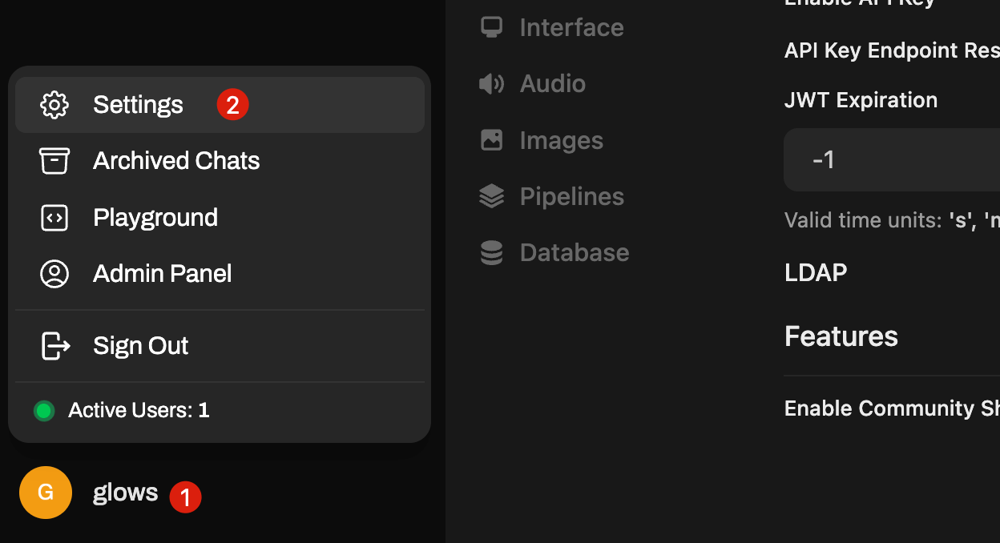
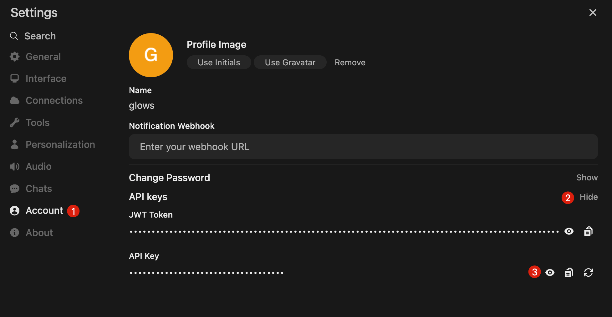

After obtaining an **API key**, you can send requests as follows. API endpoint format:

```bash
API Endpoint = HTTP Port 8080 link + /api/chat/completions
Example: https:/tw-05.access.glows.ai:25947/api/chat/completions
```

Example request:

```bash
curl -X POST https:/tw-05.access.glows.ai:25947/api/chat/completions \
  -H "Authorization: Bearer sk-f9xxxxxxxxxxxx0" \
  -H "Content-Type: application/json" \
  -d '{
        "messages": [
          {
            "role": "user",
            "content": "I just started college and want to learn Python artificial intelligence. Please help me plan my study content."
          }
        ],
        "model": "gpt-oss:20b",
        "temperature": 0.7
      }'
```

The model returns results after inference.

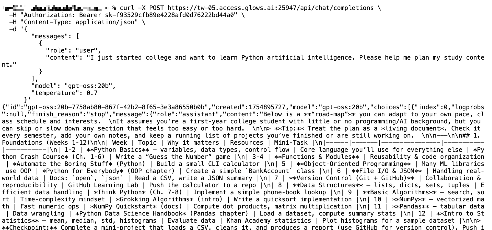

You can also use OpenAI’s Python SDK:

```python
import openai
client = openai.Client(
    base_url="https:/tw-06.access.glows.ai:25947/api", api_key="sk-f9xxxxxxxxxxxx0")

# Chat completion
response = client.chat.completions.create(
    model="gpt-oss:20b",
    messages=[
        {"role": "system", "content": "You are a helpful AI assistant"},
        {"role": "user", "content": "Tell me which is bigger, 9.11 or 9.8"},
    ],
    temperature=0.6
)
print(response)
```

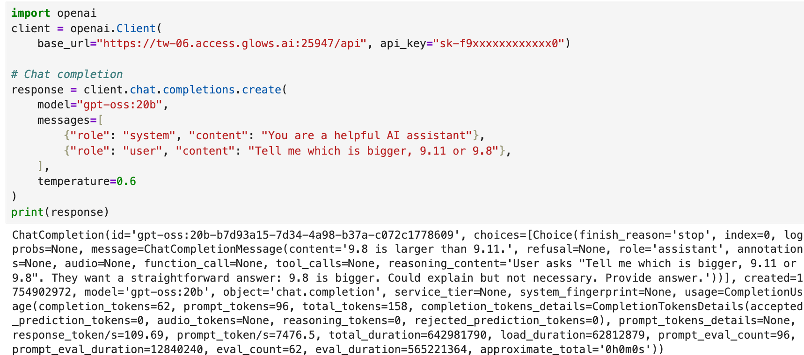

## Advanced Usage: **Auto Deploy**

Traditional GPU deployment requires manually creating and releasing instances. For sporadic usage or providing API access to third parties, this is inconvenient.

**Glows.ai Auto Deploy** creates a fixed service link. When a request is sent to the link, Glows.ai automatically creates an instance to handle it. If no requests occur within 5 minutes, the system automatically releases the instance—achieving “start-on-demand.”

### Creating a Snapshot

To preserve API keys and environment configurations, take a snapshot via **`Take Snapshot`** on Glows.ai.

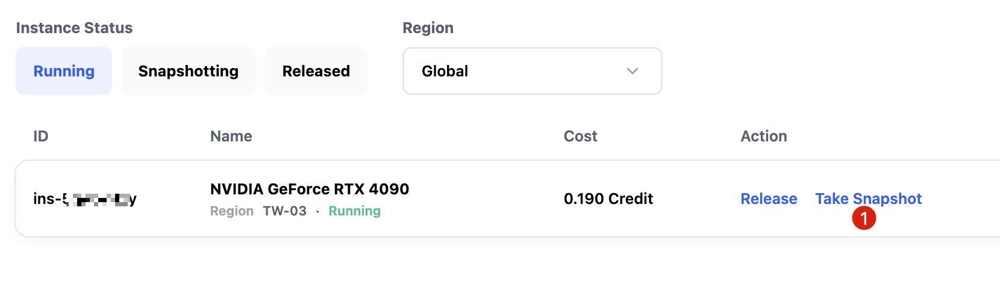

Enter a snapshot name and select **`automatically released`**, so the instance is released after snapshot creation.

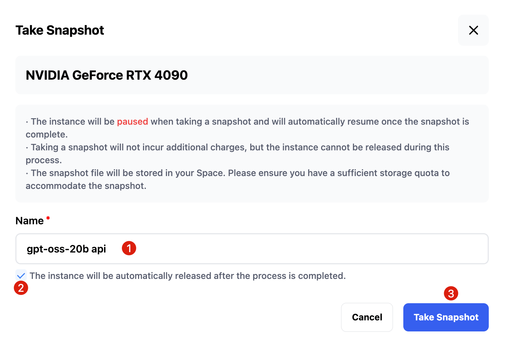

If you haven’t purchased storage, Glows.ai stores snapshots under **Snapshots → Restorable**. For this tutorial, the snapshot is small. You can buy a 5GB storage plan for \$0.5/month at [Storage Space](https://platform.glows.ai/space) and allocate 1GB to the snapshot. Afterward, move it to **Available** in [Snapshots](https://platform.glows.ai/snapshots).

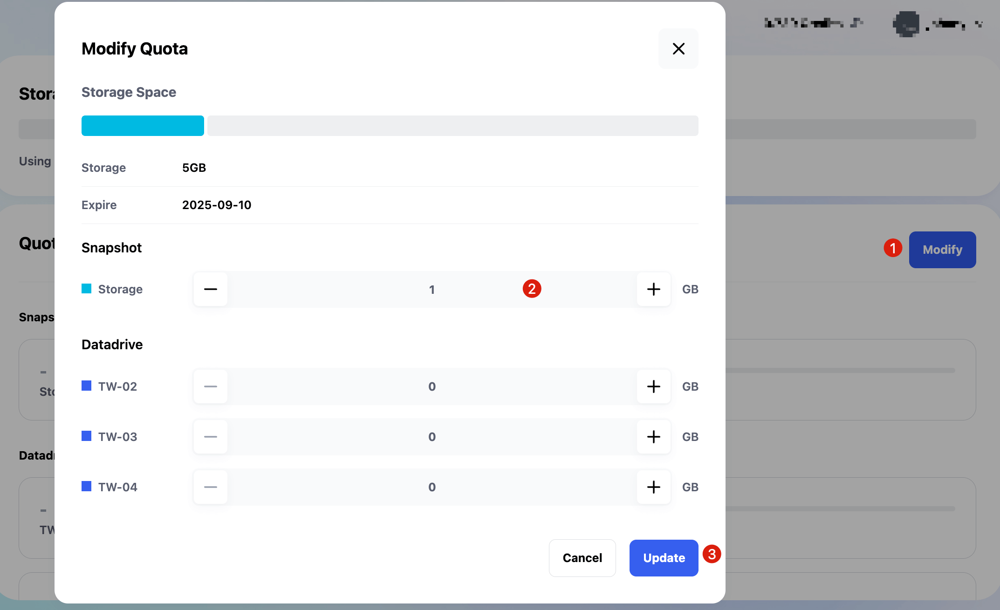

### Setting Up Auto Deploy

Go to [Auto Deploy](https:/platform.glows.ai/deploy) → `New Deploy` to create a new configuration. Name it for easy identification.

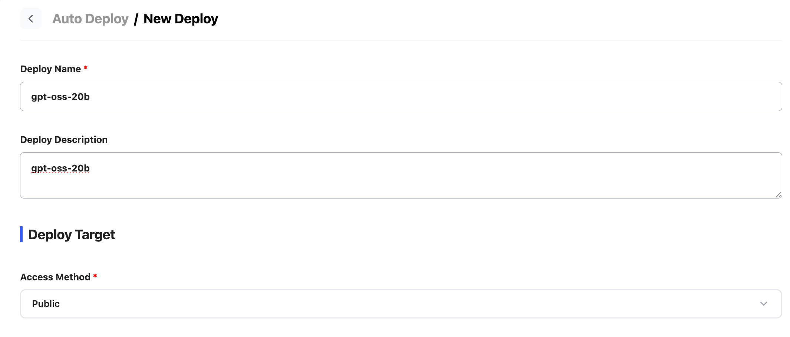

Select the GPU and environment. You can use a snapshot or system image; here, we choose the previously created snapshot.

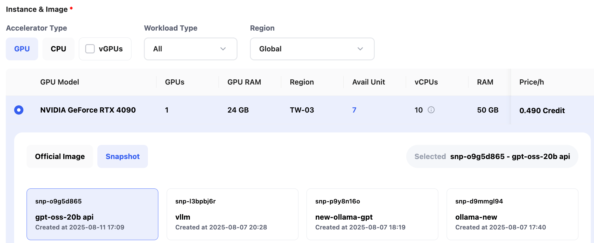

Set the service port and start command. For this example, Open WebUI runs on port 8080 automatically, so only the port needs configuration.

```bash
Port: 8080
```

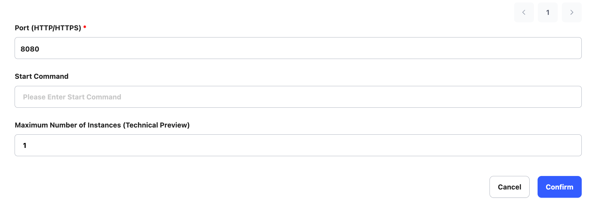
Click `Confirm` to complete setup.

### Viewing Configuration

After setup, you can see the fixed link and configuration details.

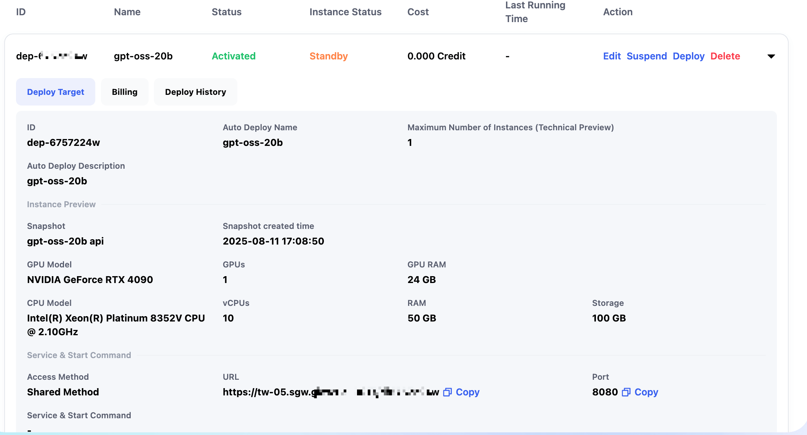

### Calling Auto Deploy Link

Replace the API endpoint with the Auto Deploy link and include your API key in Authorization:

```bash
curl -X POST https:/tw-05.sgw.glxxxxxx224w/api/chat/completions \
  -H "Authorization: Bearer sk-f9xxxxxxxxxxxx0" \
  -H "Content-Type: application/json" \
  -d '{
        "messages": [
          {
            "role": "user",
            "content": "I just started college and want to learn Python artificial intelligence. Please help me plan my study content."
          }
        ],
        "model": "gpt-oss:20b",
        "temperature": 0.7
      }'
```

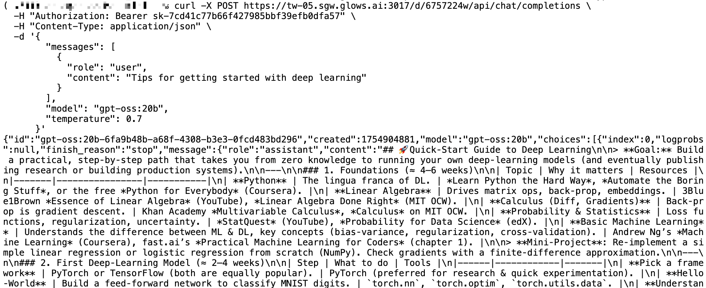

If no new requests occur within 5 minutes, the system releases the instance automatically. **Auto Deploy** also shows total costs and **Instance Status**:

- **Standby**: Configuration normal; no instance started.
- **Idle**: Request received, instance creating; or instance auto-releasing.
- **Running**: Instance running and processing requests; automatically released if idle for 5 minutes.

For large-scale use, contact Glows.ai to pre-cache images or snapshots for faster instance startup.

## Contact Us

If you have any questions or feedback while using Glows.ai, feel free to contact us:

- **Email:** [support@glows.ai](mailto:support@glows.ai)
- **Line link:** [https://lin.ee/fHcoDgG](https://github.com/mtkresearch/BreezyVoice)
