# How to Run GPUStack on **Glows.ai** with **NVIDIA GeForce RTX 4090**

This tutorial walks you through renting an **NVIDIA GeForce RTX 4090** GPU on **Glows.ai** and running **GPUStack**.

It covers the following topics:

- How to create an instance on Glows.ai
- How to deploy any model service with GPUStack
- How to call deployed models via code
- Introduction to the **Auto Deploy** on-demand mode

---

## Introduction to GPUStack

**GPUStack** is an open-source GPU cluster manager designed for running AI models. It supports multiple GPUs (e.g., NVIDIA CUDA, Apple Metal), a wide range of models (LLMs, VLMs, image models, etc.), and multiple inference backends (e.g., vLLM, Ascend MindIE). It also supports running multiple backend versions concurrently, single-node and multi-node multi-GPU inference, automatic failure recovery, load balancing, and real-time GPU monitoring.

Its innovation lies in broad GPU and model compatibility, flexible backend integration, and distributed inference across heterogeneous GPUs. Additionally, it provides an **OpenAI-compatible API**, making integration seamless and lowering the barrier to entry.

Key features include:

- Support for multiple GPU platforms (NVIDIA CUDA, Apple Metal, etc.)
- Support for multiple model types (LLM, VLM, image models, etc.)
- Multiple inference backends (vLLM, Ascend MindIE, etc.)
- Multi-version backends running in parallel, single/multi-node multi-GPU inference
- Automatic failure recovery, load balancing, real-time GPU monitoring

Compared to similar tools, GPUStack offers:

- Broad compatibility with GPUs and models
- Flexible backend integration
- Distributed inference across heterogeneous GPUs (different vendor GPUs running together)
- An **OpenAI-compatible API** to greatly simplify integration

---

## Creating an Instance

1. Log in to **Glows.ai** and create a new instance as needed. Refer to the [official tutorial](https://docs.glows.ai/docs/create-new).
2. On the **Create New** page:

   - **Workload Type**: select **Inference GPU -- 4090**
   - **Image**: choose the official **GPUStack (img-rgqwxrpy)** image (preconfigured with GPUStack service listening on port 80)

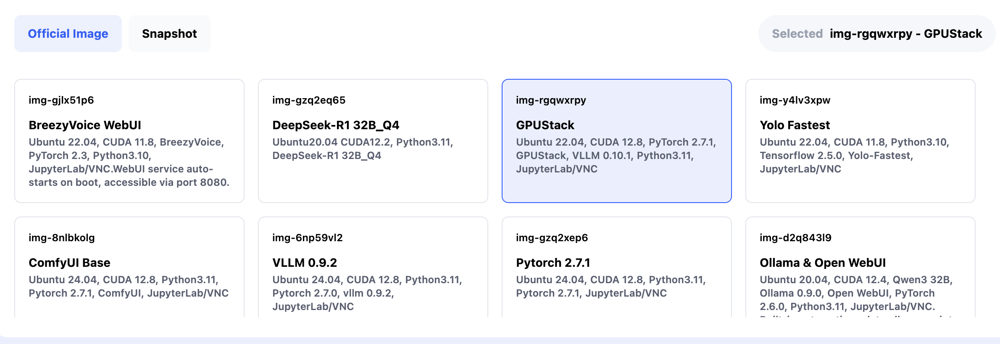

### Using Datadrive (Optional)

**Datadrive** is Glows.ai’s cloud storage service, allowing you to upload data, models, or code before creating an instance.  
When creating the instance, click **Mount** to attach a Datadrive for direct read/write access.  
Since this tutorial only demonstrates inference services, Datadrive mounting is optional.

After completing the setup, click **Complete Checkout** to create the instance.

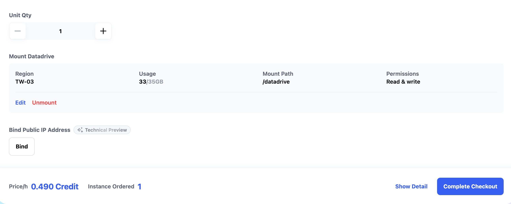

> **Note**: GPUStack images take about 30–60 seconds to start.  
> You can check the status on the **My Instances** page. Once running, the following ports will be available:

- **SSH Port 22** → SSH login
- **HTTP Port 8888** → JupyterLab
- **HTTP Port 80** → GPUStack WebUI

---

## Using GPUStack WebUI

### 1. Retrieve Username and Password

- Default username: `admin`
- Password must be retrieved inside the instance:

1. Click **HTTP Port 8888 → Open** to access JupyterLab

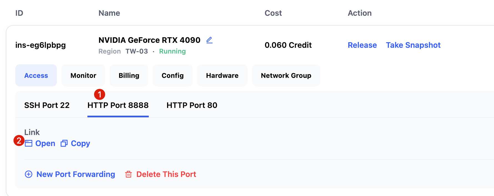

2. Open a new **Terminal**

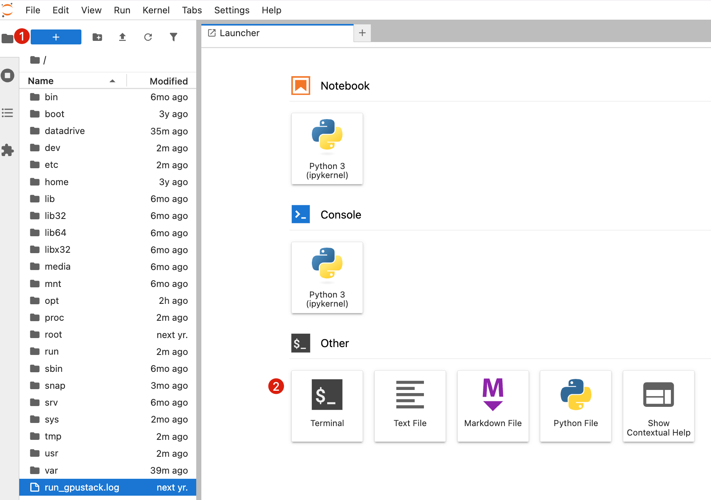

3. Run the following command to get the GPUStack WebUI password:

   ```bash
   cat /var/lib/gpustack/initial_admin_password
   ```

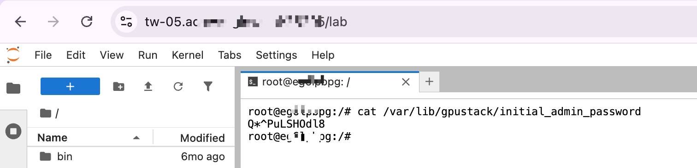

### 2. Log in to WebUI

- From the instance interface, click **HTTP Port 80 → Open**
  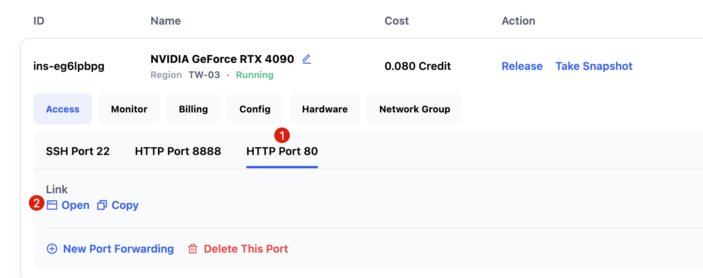

- Enter the username and password you obtained, then click `Log in`.

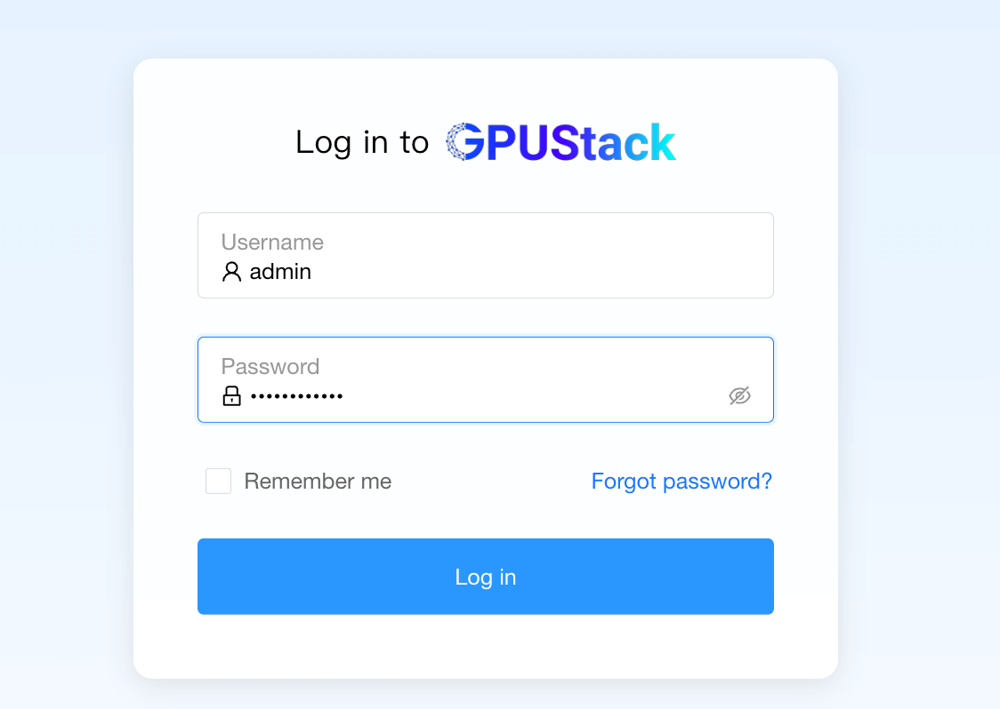

- After logging in, you will be prompted to change the password.

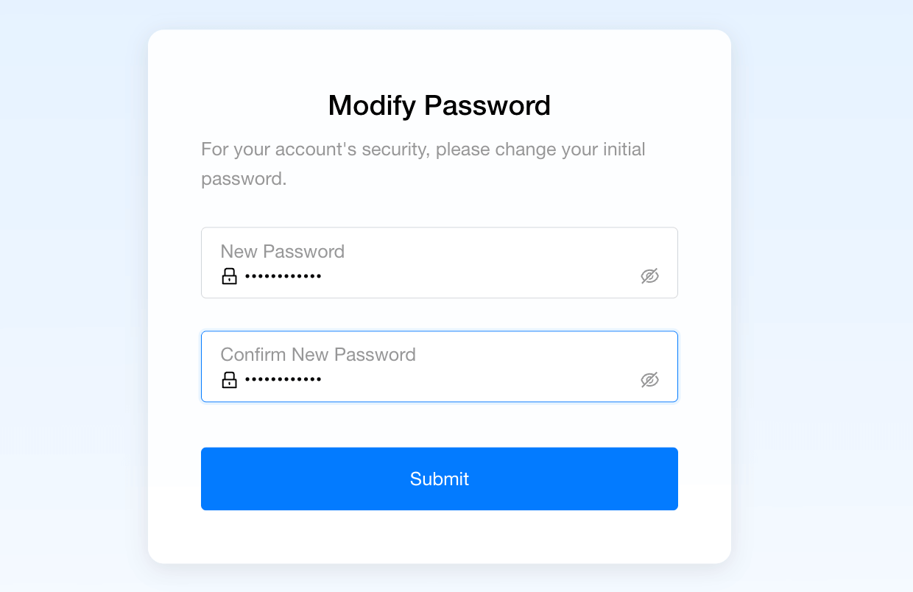

### 3. Using GPUStack WebUI

- **Dashboards**: Display statistics of current workers, GPUs, deployed models, and resource monitoring (GPU/CPU usage).
  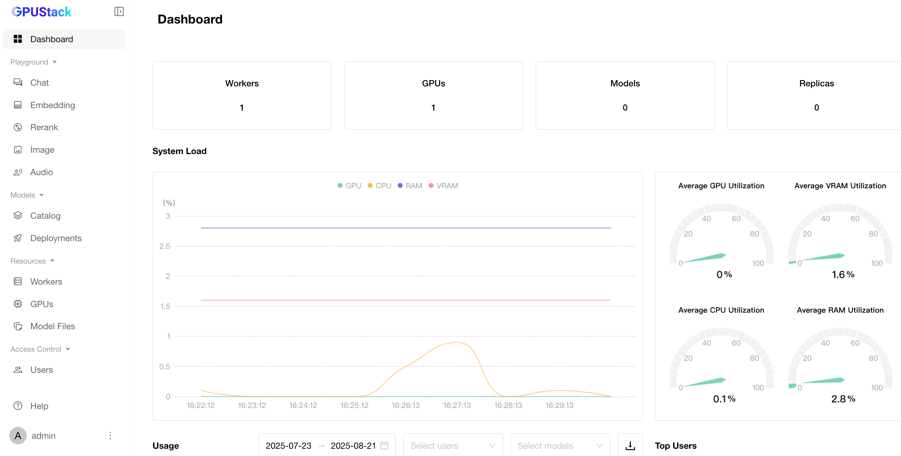

- **Catalog**: Deploy models directly from sources like Ollama and HuggingFace.
  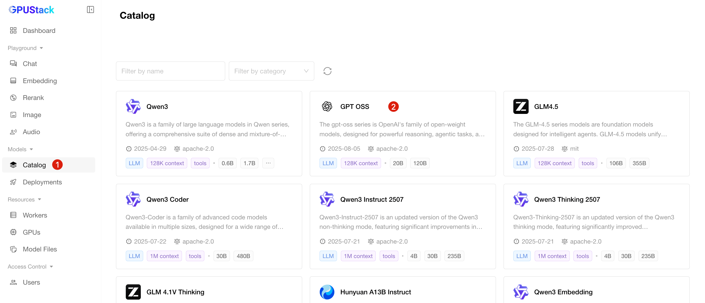

Once configured, the system moves to the **Deployments** page and begins downloading the model.

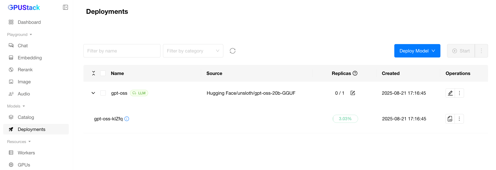

When the model finishes downloading and starts successfully, the status will show **Running**.

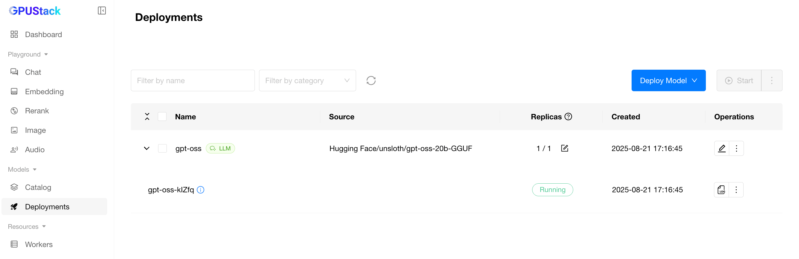

You can then switch to the **Chat** page to interact with the model directly.

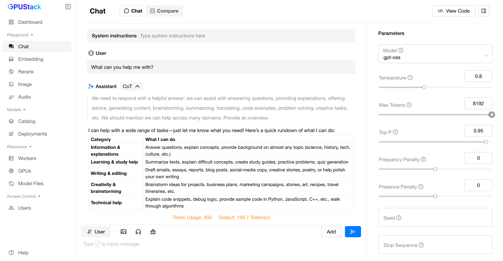

Models deployed on GPUStack can also be called via **API**. Simply click **View Code** in the interface to see official code samples for quick integration.

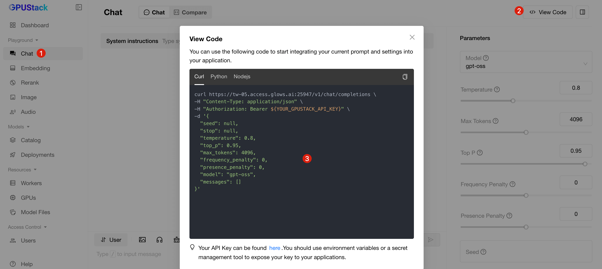

---

## Obtaining an API Key

1. Click the user avatar at the bottom left → **API Keys**
   
2. Click **New API Key** and fill in the details
   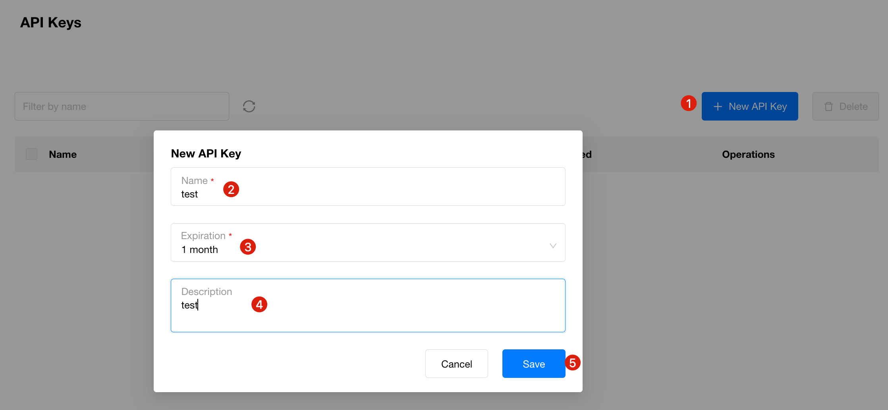
3. Use the generated API Key to call GPUStack model APIs
   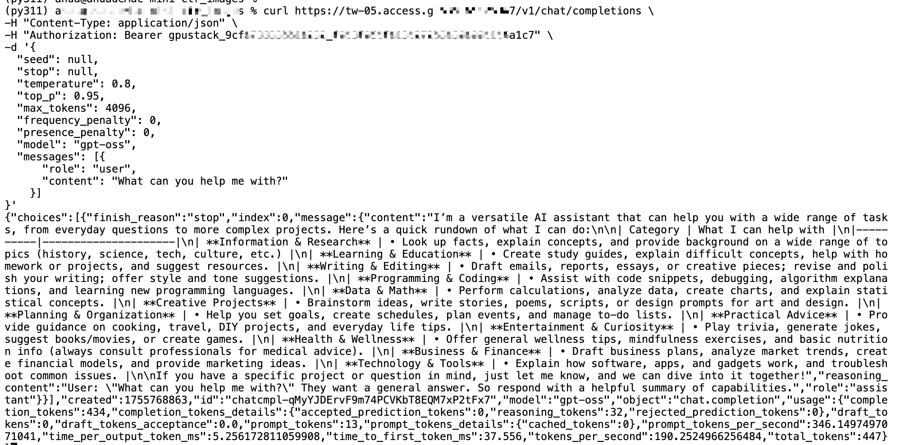

---

## Auto Deploy: On-Demand Mode

Traditional deployment requires manually creating and releasing instances, which is inconvenient for sporadic or third-party API usage.
**Glows.ai provides Auto Deploy**, which automatically creates instances and processes tasks when requests arrive.

- Each Auto Deploy has a fixed service URL
- When a request is received, the system automatically creates an instance
- If no new requests arrive within 5 minutes, the instance is automatically released

📘 For detailed instructions, see: [Auto Deploy Documentation](https://docs.glows.ai/docs/auto-deploy-usage)

---

## Contact Us

If you have any questions or suggestions while using Glows.ai, feel free to contact us via Email, Discord, or Line.

**Glows.ai Email:** support@glows.ai

**Discord:** https://discord.com/invite/glowsai

**Line:** https://lin.ee/fHcoDgG
