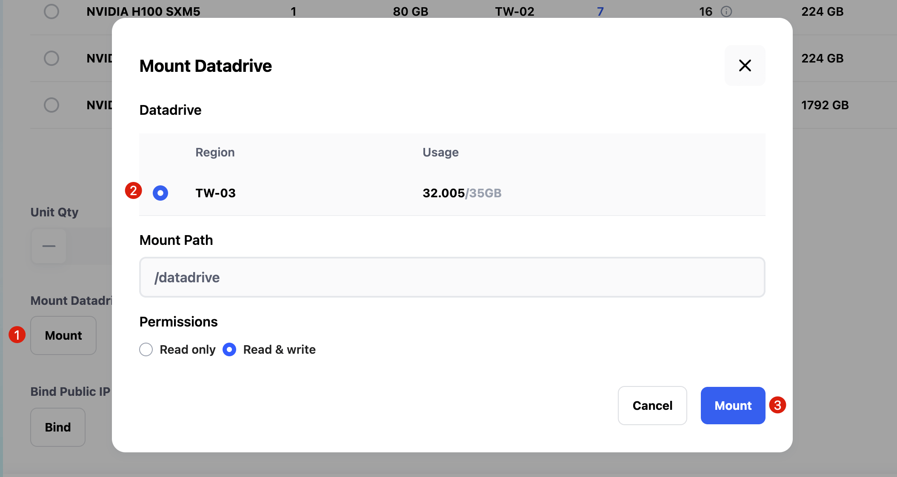
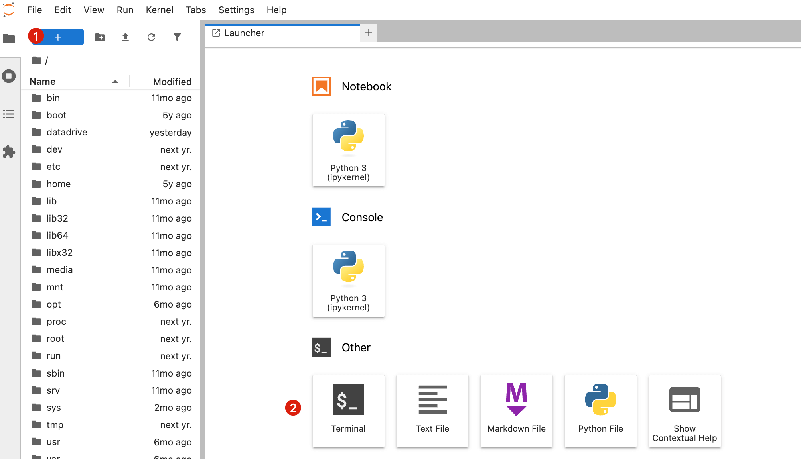
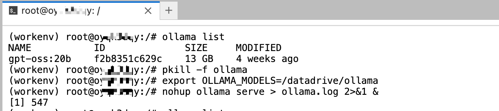
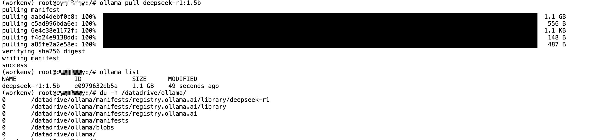
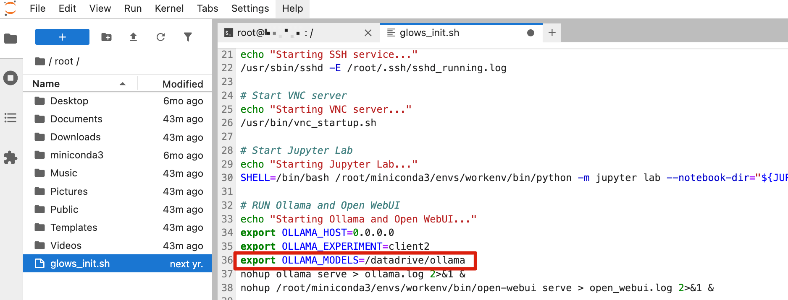
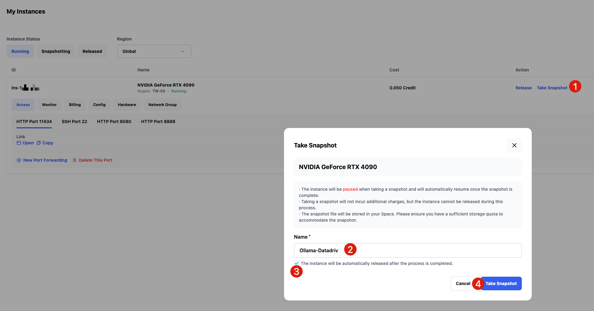

# How to Set Ollama Model Storage Path on Glows.ai

This tutorial demonstrates how to set the **Ollama model storage path** to `/datadrive/ollama` in a **Glows.ai** instance.

Snapshots save all changes inside an instance **except** for the `/datadrive` directory.  
If model files are stored on the local instance disk, it may result in an **oversized Snapshot**, which takes a long time to pull when restarting—leading to a poor user experience.

To achieve smoother performance, it’s recommended to store **models, data, and code** under `/datadrive`, while keeping Snapshots focused only on environment changes (such as `pip`/`apt` package installations).

---

## Set Ollama Model Storage Path

Before proceeding, make sure you checked **Mount** when creating the instance to attach your `Datadrive`.



Once the instance is created, go to the instance interface and open **HTTP 8888 Port (JupyterLab service)**. Create a new **Terminal** as shown below:



In the Terminal, run the following commands step by step:

1. Stop the running Ollama service
2. Set the Ollama model storage path to `/datadrive/ollama`
3. Restart the Ollama service

```bash
pkill -f ollama
export OLLAMA_HOST=0.0.0.0
export OLLAMA_MODELS=/datadrive/ollama
nohup ollama serve > ollama.log 2>&1 &
```



After completing the configuration and restarting, any models downloaded with `ollama pull` will automatically be stored under `/datadrive/ollama`.
This way, even without creating a Snapshot, you can simply re-mount the Datadrive next time and continue using the previously downloaded models.



---

## Automatically Set Ollama Model Path on Startup

If you prefer not to manually set the storage path each time you launch a new instance, you can add the environment variable directly in the **Glows.ai instance startup file**.

The startup file is located at: `/usr/bin/glows_init.sh`.
For easier editing, first create a symbolic link to `/root/glows_init.sh` in the Terminal:

```bash
ln -sf /usr/bin/glows_init.sh /root/glows_init.sh
```

Next, in JupyterLab’s left navigation panel, open the **root directory** and double-click to edit `glows_init.sh`.
Add the following line **before Ollama starts**:

```bash
export OLLAMA_MODELS=/datadrive/ollama
```

Don’t forget to save the file with **Ctrl + S**.



Once the setup is complete, you can create a Snapshot.
Click **Take Snapshot** in the instance interface, enter a Snapshot name, and optionally check **Release instance after Snapshot completes** if the current instance is no longer needed.



From then on, any new instance launched from this Snapshot will automatically store Ollama models under `/datadrive/ollama`, eliminating the need to reconfigure.

---

## Contact Us

If you have any questions or suggestions while using Glows.ai, feel free to contact us via Email, Discord, or Line.

**Glows.ai Email:** support@glows.ai

**Discord:** https://discord.com/invite/glowsai

**Line:** https://lin.ee/fHcoDgG
