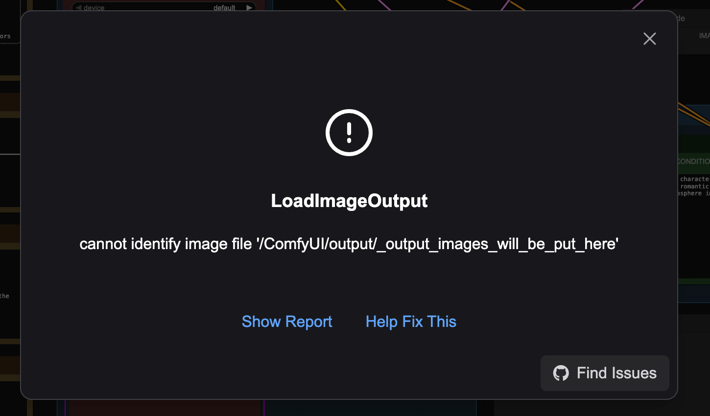
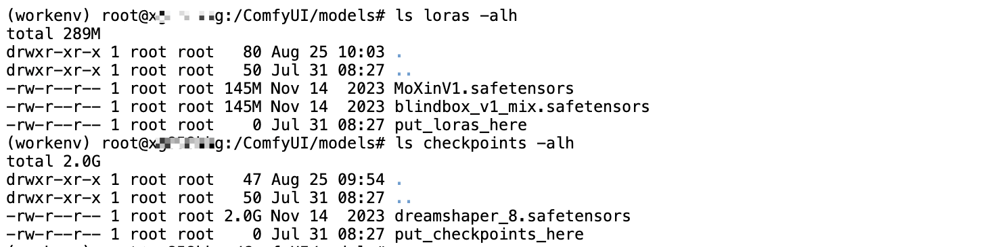

# How to Run Custom ComfyUI Workflows on Glows.ai

This tutorial will guide you through renting an **NVIDIA GeForce RTX 4090** GPU on Glows.ai and using ComfyUI for AI image generation.

This article covers:

- How to create an instance on Glows.ai
- Basic operations of ComfyUI
- How to call ComfyUI via code
- Common issues with ComfyUI

ComfyUI is a graphical user interface (GUI) designed for AI diffusion models like Stable Diffusion (SD), greatly simplifying the image generation process. With intuitive drag-and-drop operations, users can quickly adjust model parameters and generate images without coding. Compared to traditional SDWebUI, ComfyUI offers more customization options, supports more flexible model management and parameter tuning, and allows for finer control. In addition, ComfyUI is optimized for performance.

## Creating an Instance

You can create an instance on Glows.ai as needed. For detailed steps, refer to the [official guide](https://docs.glows.ai/docs/create-new). Be sure to select the **ComfyUI FLUX.1-Kontext** (img-87p9kkq2) image, which comes with the environment pre-configured.

On the **Create New** page, set Workload Type to **Inference GPU -- 4090**, and select the **ComfyUI FLUX.1-Kontext** image. This image has all dependencies pre-installed and starts the ComfyUI service, which listens on port 8188.


**Datadrive** is Glows.ai’s cloud storage service. You can upload data, models, or code to Datadrive before creating an instance. When creating the instance, click the `Mount` button to mount Datadrive to your instance, allowing direct read/write access.

This tutorial demonstrates inference only, so mounting Datadrive is not required.

Once everything is set, click `Complete Checkout` at the bottom right to finish creating the instance.


The ComfyUI FLUX.1-Kontext image takes about 30-60 seconds to start. Once started, you can view the instance status and details on the `My Instances` page:

- **SSH Port 22**: SSH connection port
- **HTTP Port 8888**: JupyterLab interface
- **HTTP Port 8188**: ComfyUI interface


## Using ComfyUI FLUX.1-Kontext

Click the Open link under HTTP Port 8188 to launch ComfyUI. In the popup, select the desired Workflow template. To run the FLUX.1-Kontext model, choose Flux and select the corresponding Workflow, such as Flux Knotext Dev(Basic).


After selecting a Workflow, the system will automatically check if all required models are present. If any are missing, ComfyUI will display an error message indicating which models are missing and where to place them.


If you use the ComfyUI FLUX.1-Kontext image, you won’t encounter missing model errors, as all necessary models are pre-installed. Once the Workflow loads, you’ll see all nodes and their connections.


If you run the Workflow directly, you may see errors, such as needing to place an image in the /ComfyUI/output folder.



You can also click the `choose file to upload` button under the `Load Image` node in the interface to upload an image from your local machine.


Next, modify the prompt and click `RUN` to generate an image. During computation, the GPU usage is about 18GB, with 100% memory utilization.


Generating an image with the FLUX.1-Kontext model on a 4090 takes about 23 seconds.


The generated images are saved in the /ComfyUI/output folder on your Glows.ai instance. You can download them directly from this folder or via the ComfyUI interface.


## How to Call ComfyUI via Code

ComfyUI provides an API mode for advanced users. First, click `Workflow` -- Export(API) in the top left of the interface to export the Workflow in API format.


Refer to the official [script_examples](https://github.com/comfyanonymous/ComfyUI/tree/master/script_examples) for sample code. Replace the prompt section as needed.

## Common Issues with ComfyUI

### How to Restart or Update ComfyUI?

Some operations may require restarting ComfyUI. Click the `Manager` button in the top right, then click `Restart` in the popup. The ComfyUI Manager plugin offers many other features—feel free to explore.


### How to Set the Default Workflow to Load?

Click the Workflow button in the top left, then select `Browse Templates` in the popup to view all official Workflows.


Select the Workflow you want to run.


If any models are missing, a prompt will appear. Click `Copy URL`, then download the model to the correct folder inside your instance. After downloading, close the popup.


The default ComfyUI project path is /ComfyUI, but sometimes it is /root/ComfyUI. Model files are stored in the models folder under the project path. Download models according to the actual path.

```bash
# Example for project path /ComfyUI
cd /ComfyUI/models/
wget -O checkpoints/dreamshaper_8.safetensors "https://civitai.com/api/download/models/128713?type=Model&format=SafeTensor&size=pruned&fp=fp16"
wget -O loras/MoXinV1.safetensors "https://civitai.com/api/download/models/14856?type=Model&format=SafeTensor&size=full&fp=fp16"
wget -O loras/blindbox_v1_mix.safetensors "https://civitai.com/api/download/models/32988?type=Model&format=SafeTensor&size=full&fp=fp16"
```


After downloading, check the model files.



Once the models are downloaded, refresh the interface to run the related Workflow.


### ComfyUI Interface Not Displaying Properly After Adding Models?

Make sure the models are placed in the correct folder. The default model path is the models folder under the ComfyUI working directory.

For example, if the working directory is /ComfyUI, the model path is /ComfyUI/models

ㄋ

---

## Contact Us

If you have any questions or suggestions while using Glows.ai, feel free to contact us via Email, Discord, or Line.

**Glows.ai Email:** support@glows.ai

**Discord:** https://discord.com/invite/glowsai

**Line:** https://lin.ee/fHcoDgG
