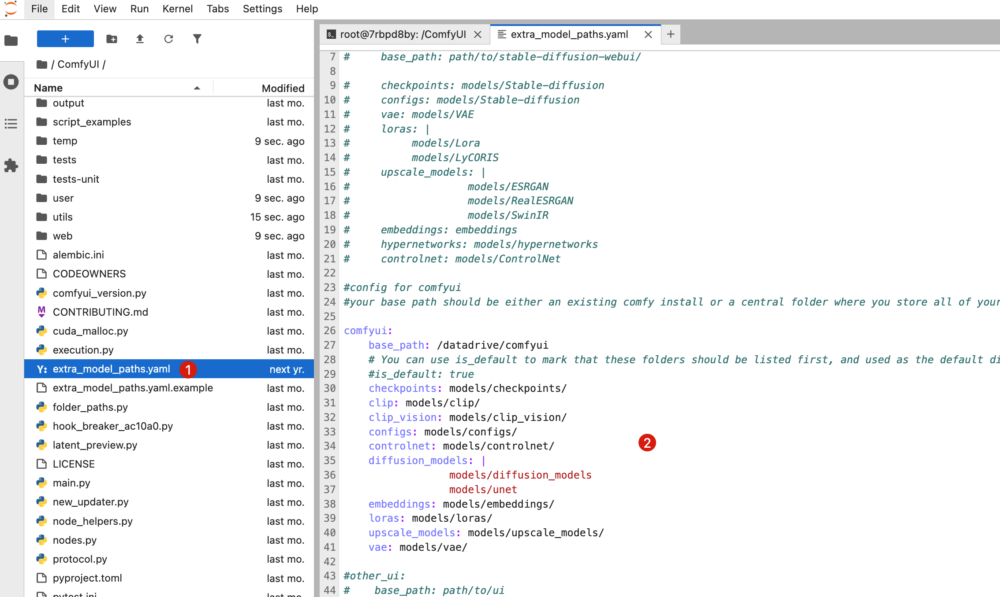
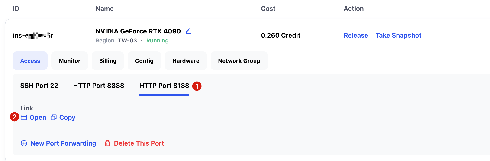
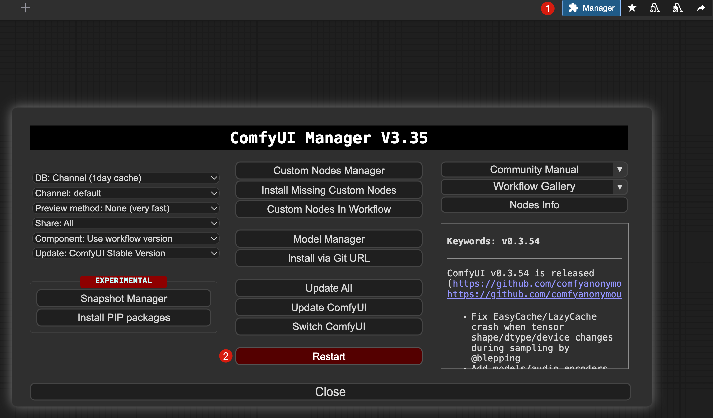

# How to Set Custom Model Storage Path in ComfyUI

ComfyUI supports setting additional model storage paths. Once configured, ComfyUI can recognize models in both the default path and the additional path. It is recommended to store models on the Datadrive so you don’t need to create a snapshot every time you add a new model.

---

## Configuring the Additional Model Path

As an example, to set the additional model path to `/datadrive/comfyui`, access your instance’s **HTTP 8888 Port** (JupyterLab link), open a terminal, and run the following commands to copy the additional model configuration file and create the model storage directory:

```bash
cd /ComfyUI
cp extra_model_paths.yaml.example extra_model_paths.yaml
mkdir /datadrive/comfyui
```


Then, double-click the copied `extra_model_paths.yaml` file in the `/ComfyUI` directory, uncomment the `comfyui` section, and set `base_path` to `/datadrive/comfyui` (remember to save with `Ctrl + S`).



---

## Restarting ComfyUI

You need to restart ComfyUI for the changes to take effect. Access the ComfyUI interface via **HTTP Port 8188**.



Click `Manager -> Restart` in the top-right corner of the interface to restart ComfyUI. After restarting, models stored in `/datadrive/comfyui` will be recognized and available.



---

## Contact Us

If you have any questions or suggestions while using Glows.ai, feel free to contact us via Email, Discord, or Line.

**Glows.ai Email:** support@glows.ai

**Discord:** https://discord.com/invite/glowsai

**Line:** https://lin.ee/fHcoDgG
