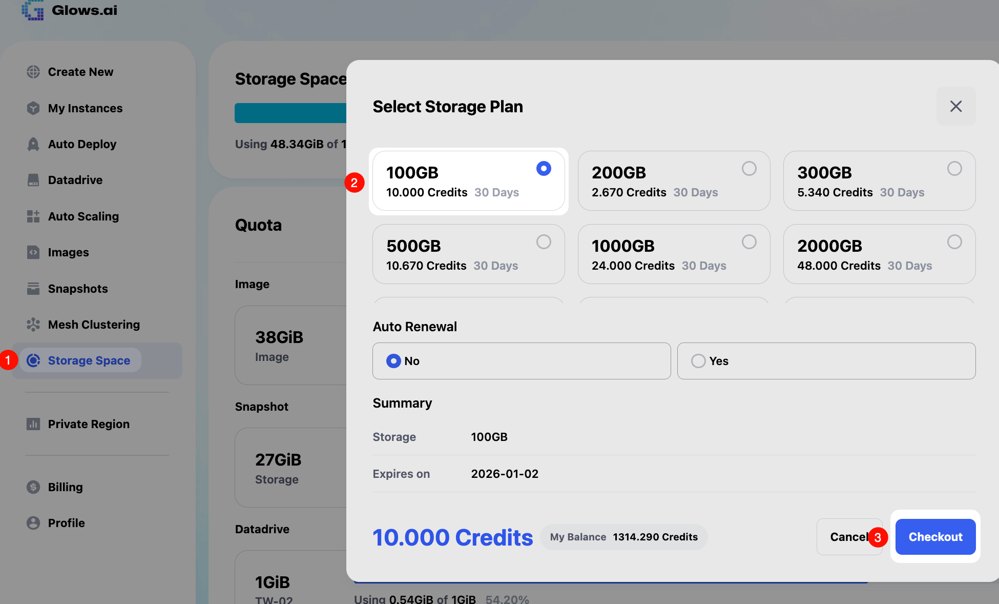
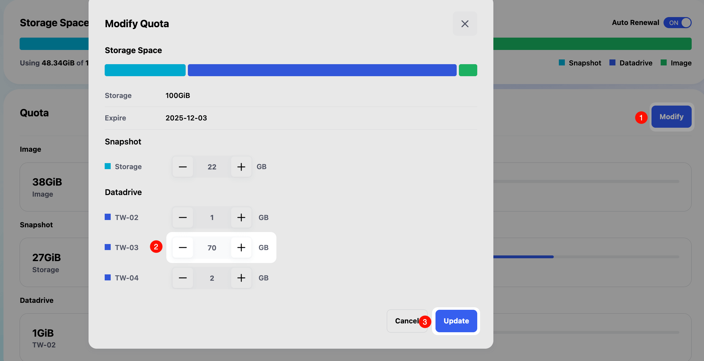
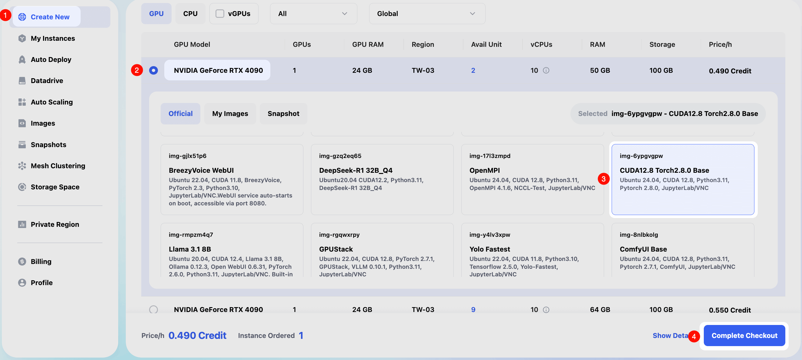
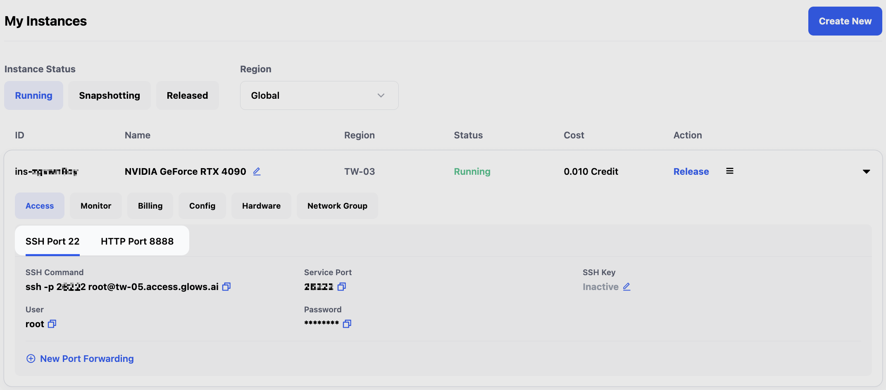
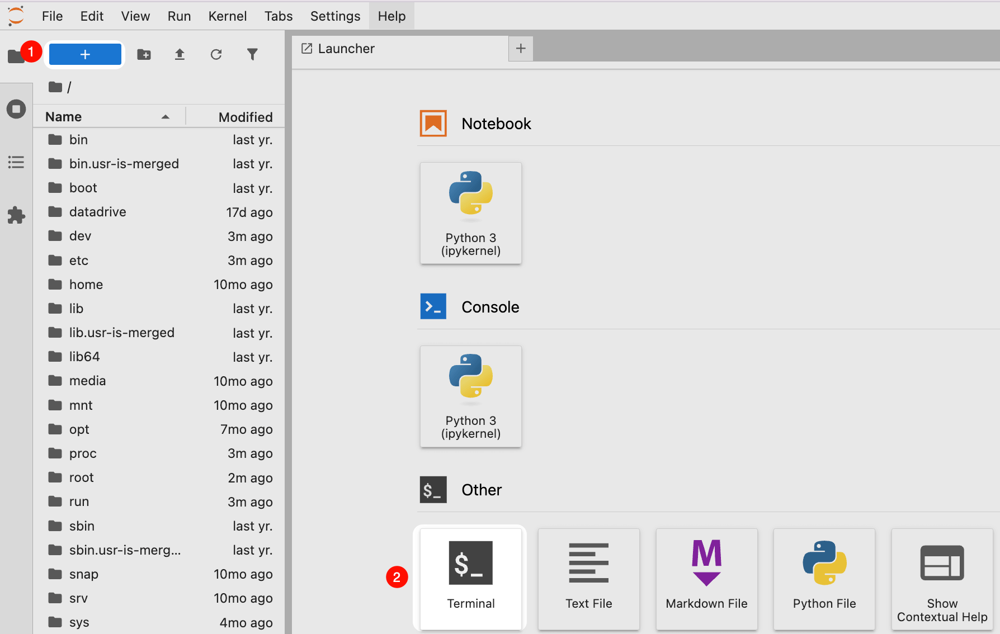
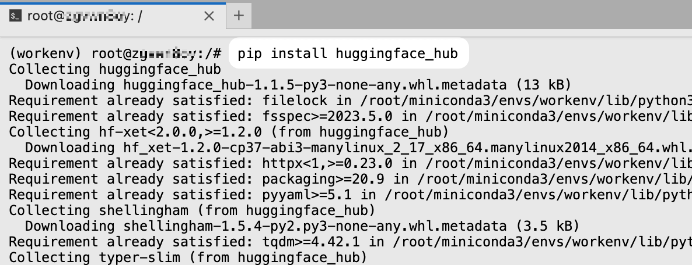
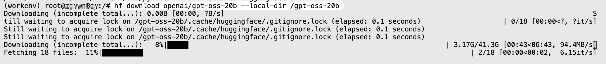
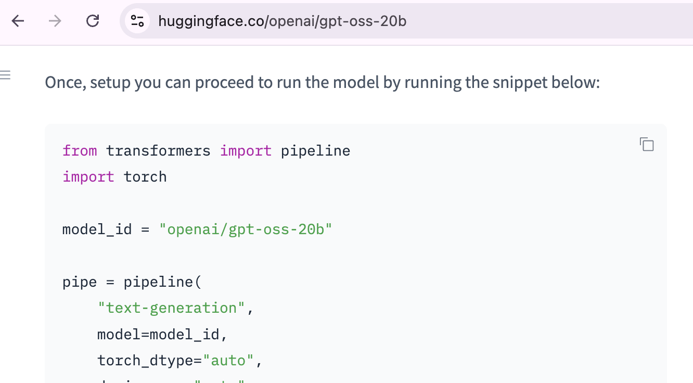

This tutorial provides a detailed guide on how to download HuggingFace models on **Glows.ai**, with two available methods: **local download and upload (stored in Glows.ai Datadrive)**, and **instance-based download (stored in a Glows.ai instance)**.

- **Stored in Glows.ai Datadrive**: Permanently stored; download speed depends on your local internet connection. This method is suitable for users who need to use the data multiple times (e.g., for model services).
- **Stored in Glows.ai Instance**: Data is valid only while the instance is running; once released, the data will be deleted. Instances share bandwidth in the same data center, offering faster download speeds. This method is suitable for users who need the data for one-time use (e.g., testing model performance).

------

## Local Download and Upload

This method saves data to **Glows.ai Datadrive**. You must first purchase adequate storage space on the Glows.ai platform, then allocate the storage to the corresponding regional Datadrive.

### Activate Storage

Suppose you need to download a model of **65GB** and plan to use an **NVIDIA GeForce RTX 4090** GPU in the **TW-03 region**. You’ll first need to go to [Storage Space](https://platform.glows.ai/space) and purchase a **100GB** storage package.



Then, click the **Modify** button in the **Storage Space** interface to allocate **70GB** of space to the **TW-03 region Datadrive**.



### Data Drive Client Download Method

The **Data Drive client** currently supports downloading models directly from HuggingFace to the corresponding regional Datadrive.
 The process works as follows: using your local network, the client downloads HuggingFace model chunks locally, then synchronizes them to the Datadrive.

- Install the Data Drive client: [Download here](https://glows.ai/datadrive)
- Follow the tutorial: [Download models from HuggingFace](https://docs.glows.ai/zh-TW/docs/datadrive-app#步驟-4上傳或匯入檔案資料夾)

------

## Download via Instance

### Create an Instance

This method requires creating an instance on **Glows.ai**. Suppose you want to use an **NVIDIA GeForce RTX 4090 GPU** in the **TW-03 region**, with the environment **CUDA 12.8 Torch 2.8.0 Base**.



Once the instance is created, you can connect to it via **SSH** or access it through **HTTP Port 8888 (JupyterLab)**.



### Download Model Using Commands

JupyterLab is simple to use. The following example demonstrates operations within JupyterLab.
 Open a new **Terminal**.



Then, enter the following command to install HuggingFace’s official model management tool **huggingface_hub**:

```bash
pip install -U huggingface_hub
```



Once installed, you can use the `hf` command to download model files directly to the instance.
 For example, to download `openai/gpt-oss-20b` into the `/gpt-oss-20b` directory, use:

```bash
hf download openai/gpt-oss-20b --local-dir /gpt-oss-20b
```



------

## Running HuggingFace Models on Glows.ai

Some frameworks support directly loading and running HuggingFace models, such as **Transformers**, **SGLang**, and **GPUStack**.
 You can use the software you’re most familiar with for deployment or refer to the tutorials below:

- [How to run DeepSeek-R1 on multiple machines with multiple GPUs using SGLang on Glows.ai](https://glows.ai/article/deepseek_r1_using_sglang)
- [How to Run GPUStack on Glows.ai](https://glows.ai/article/run_gpustack_on_glowsai)

Additionally, the HuggingFace official website also provides usage examples.
 If you have any questions or suggestions during your implementation on Glows.ai, feel free to contact us through the channels listed in [Contact Us](../c/692cf77a-1754-8326-82ef-a2ec6beb1010#contact-us).



------

## Contact Us

If you have any questions or suggestions while using **Glows.ai**, feel free to reach out via email, Discord, or Line.

- **Glows.ai Email Address:** [support@glows.ai](mailto:support@glows.ai)
- **Discord:** https://discord.com/invite/Glows.ai
- **Line link:** https:/lin.ee/fHcoDgG
