This tutorial will walk you through how to rent an **NVIDIA GeForce RTX 4090** GPU on Glows.ai to run OpenClaw with a local model, and share a safer and more convenient deployment approach.

This article includes the following content:

- How to create an instance on Glows.ai
- How to configure a local model with OpenClaw
- How to connect to and use OpenClaw

OpenClaw is an open-source AI Agent framework that has gained rapid popularity recently. It is designed to combine large language models with practical tool capabilities, enabling AI not only to answer questions but also to execute real tasks on computers or servers. It typically runs in a self-hosted manner and can be deployed on local devices or in cloud environments, while interacting with users through APIs or chat applications.

Unlike traditional conversational AI, OpenClaw functions more like an intelligent assistant with action capabilities: the AI model is responsible for understanding goals and making decisions, while OpenClaw handles tool orchestration, command execution, and overall workflow management.

Now let’s dive into a hands-on example together.

## Create an Instance

We create an instance on demand on Glows.ai. You can refer to the [tutorial](https:/docs.glows.ai/docs/Create%20New). Please make sure to use the officially preconfigured **OpenClaw**(img-6np58jp2) image.

On the `Create New` page, select Inference GPU -- 4090 for Workload Type, then choose the **OpenClaw** image first. This image has already been preconfigured with the required environment.


**Datadrive** is a cloud storage service provided by Glows.ai for users. Before creating an instance, users can upload the data, models, code, and other content they want to run to Datadrive. When creating the instance, simply click the `Mount` button in the interface to mount Datadrive to the instance being created. This allows us to directly read and write Datadrive content from within the instance.

In this tutorial, we only run inference services, so mounting Datadrive is not required.

Once everything is ready, click `Complete Checkout` in the lower-right corner to complete instance creation.


The estimated startup time for an **OpenClaw** image instance is 30–60 seconds. We can view the instance status and related information in the `My Instances` interface. After the instance starts successfully, we will see the following information:

- **SSH Port 22** is the SSH connection for the instance
- **HTTP Port 8888** is the JupyterLab connection
- **HTTP Port 11434** is the Ollama API connection

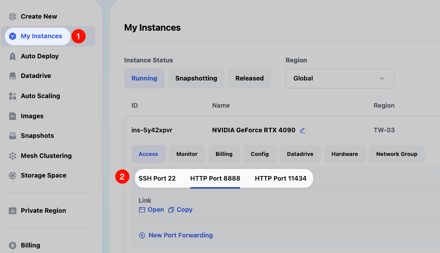

## Connect to the Instance

Visit the link corresponding to `HTTP Port 8888` on the instance page to open the JupyterLab service. Then follow the illustration to create a new Terminal. 

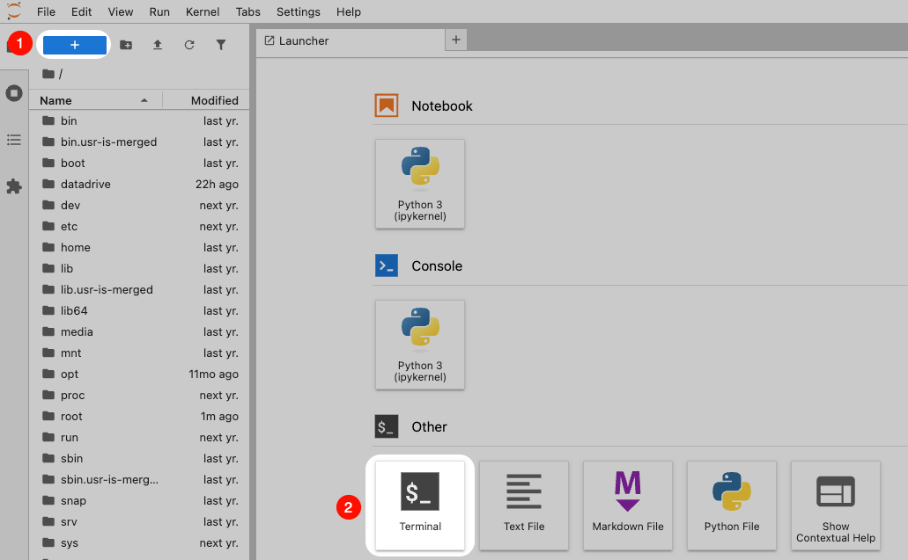

## Upgrade OpenClaw

Thanks to the open-source community, OpenClaw is iterating very quickly. You can upgrade to the latest version to obtain the full feature set.

First, enter the following commands in the Terminal to check the version status. You will see the latest available version number.

```bash
openclaw --version
openclaw update status
```


Then enter the following command to update the version.

```bash
openclaw update
```


**Reminder:** The final `systemctl` command error can be ignored. This is because `systemctl` is not supported inside Docker containers. The tutorial below will explain how to start the OpenClaw service manually.

## Basic OpenClaw Configuration

First, enter the following command to open the OpenClaw configuration interface, mainly for agreeing to the OpenClaw terms and configuring the Telegram API Token.

```bash
openclaw onboard
```

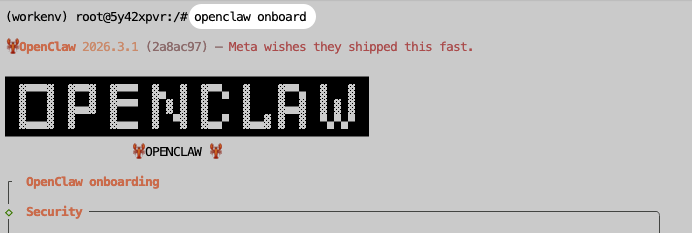

Use the default options. The model configuration can be left empty for now, as we will configure a local Ollama model later. You may also configure a third-party model API as needed.

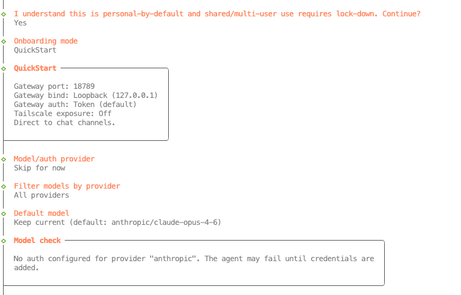

You can configure the communication software according to your needs. This tutorial uses Telegram as an example. First, you need to send the following command to `@BotFather` on Telegram to create a new Bot and obtain the Bot API Token.

```bash
/newbot
```

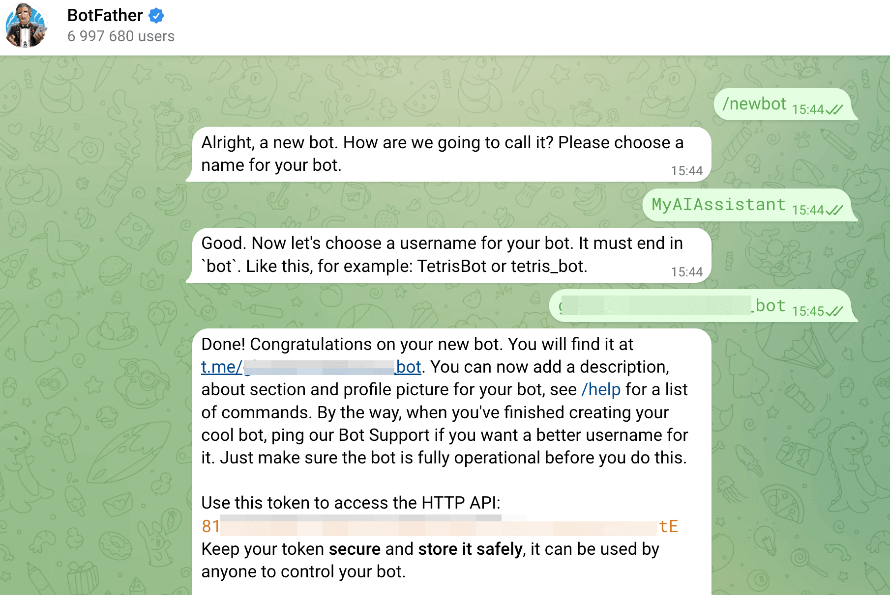

Then enter the Telegram Bot API Token in the OpenClaw configuration interface.

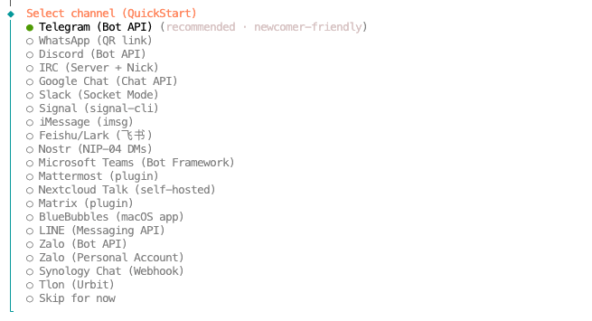

Finally, when you see `Onboarding complete`, the configuration is complete.

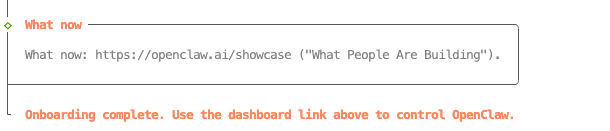

## OpenClaw Local Model Configuration

With Ollama, you only need a single command to download and configure a model for OpenClaw. The following command uses the `qwen3.5:4b` model as an example.

```bash
ollama launch openclaw --model qwen3.5:4b
```

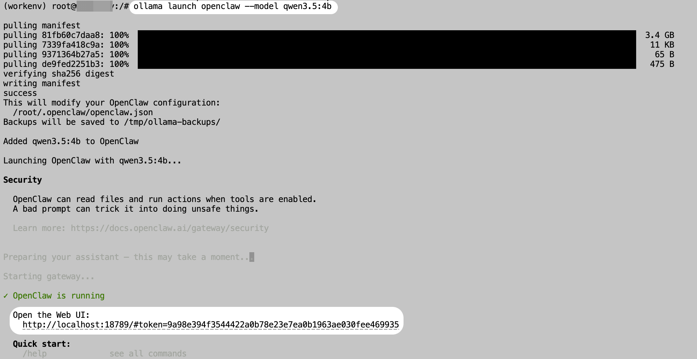

After downloading the model, the OpenClaw service will start automatically. We can then begin using OpenClaw.

**Reminder:** Remember the link under `Open the Web UI` here, especially the token. It will be needed later when we access the Web interface.

## Three Entry Points for Interacting with OpenClaw

### Chat in the CLI

After the previous command finishes running, you can directly chat with OpenClaw in the interface. For example, here we ask it to create a Python file and write the Fibonacci algorithm into it.

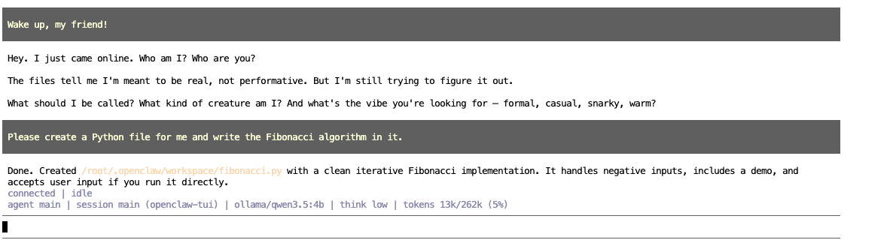

### Chat in Telegram

First, send a message to the Telegram Bot created earlier. After a short while, you will receive an authentication command.

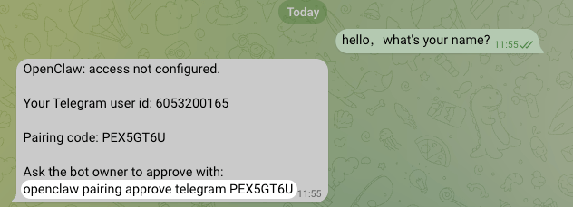

Copy the authentication command above and execute it in the instance Terminal. After execution is complete, you can formally use OpenClaw in Telegram.


To test its memory capability, we can directly ask it for the path of the Fibonacci algorithm file we asked it to write earlier. As shown in the screenshot, the Bot quickly replies with both the path and the source code content.


### Chat in a Web Browser

For security reasons, OpenClaw binds its service host to `127.0.0.1` by default. We need to use SSH port forwarding to forward the OpenClaw service port from the instance to a local computer port before accessing it.

On the My Instance page in Glows.ai, you can view the SSH information. We need to convert the SSH Command into an SSH port forwarding command.

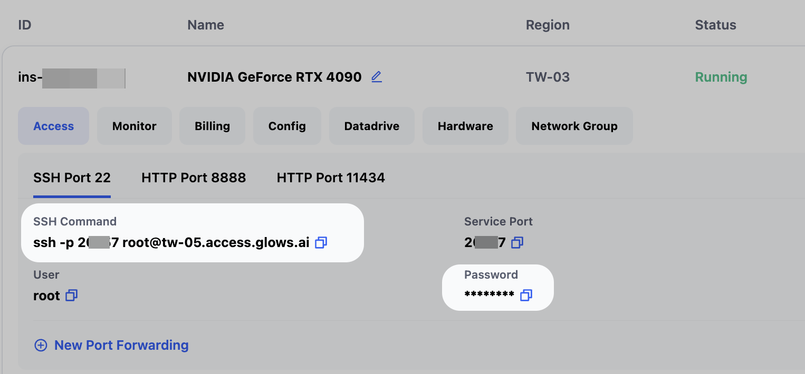

The modified command is as follows. You only need to replace these parts of the command.

- Replace `2xxx7` with the corresponding value in the SSH Command
- Replace `18888` with any available port number on your local computer
- Replace `root@tw-05.access.glows.ai` with the corresponding value in the SSH Command

```bash
ssh -p 2xxx7 -NL 18888:localhost:18789 root@tw-05.access.glows.ai
```

Run the modified SSH port forwarding command in your local Terminal/CMD. After pressing Enter, paste the SSH Password. It is normal that nothing is displayed after pasting the password. Press Enter again. If no errors appear, the message has been forwarded successfully.


**Reminder:** If you are a Windows user, it is recommended to download and install [Windows Git](https://git-scm.com/install/windows) locally.

After the forwarding succeeds, visit `http://localhost:18888/#token=xxxxxxxx` locally. Please replace the token value with the token displayed when starting the OpenClaw service in [OpenClaw Local Model Configuration](#OpenClaw Local Model Configuration).


------

## Contact Us

If you have any questions or suggestions while using Glows.ai, feel free to contact us via email, Discord, or Line.

**Email:** [support@glows.ai](mailto:support@glows.ai)

**Discord:** [https://discord.com/invite/glowsai](https://discord.com/invite/glowsai)

**Line:** [https://lin.ee/fHcoDgG](https://lin.ee/fHcoDgG)
