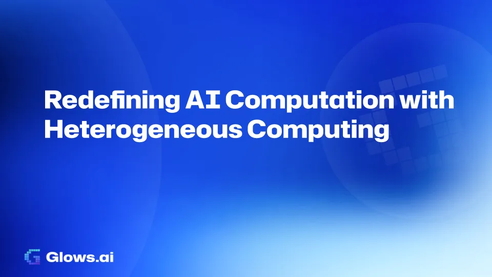

In today’s rapidly advancing AI landscape, computing power has become a critical bottleneck limiting AI development. Glows.ai addresses this with heterogeneous computing: the platform supports a wide range of hardware and uses its **Elastica technology** to combine different types of computational resources within a single instance.

# **Comprehensive Hardware Support**

From AI-optimized TPUs and NPUs to NVIDIA H100, H200, and GeForce RTX 4090 GPUs, as well as Apple Silicon chips, the platform covers nearly all mainstream AI computing hardware. This extensive compatibility ensures that users can choose the most suitable resources for their specific needs.

Of particular note is the platform’s support for Apple’s proprietary chips. By providing Apple silicon GPU accelerators through a virtualized OSX environment, Glows.ai offers high-performance solutions tailored for specific AI applications. This broadens the range of available computing options and delivers top-tier solutions for performance-intensive projects.

# **Elastica Technology: Breaking Traditional Boundaries**

Glows.ai’s major innovation lies in its proprietary Elastica technology, which enables near-zero-latency integration of heterogeneous computing resources. This allows users to dynamically combine different types of accelerators within the same computational instance. This means users can flexibly combine TPUs, GPUs, CPUs, and other resources according to their needs, creating an optimal computing environment.

This hyper-converged computing model not only enhances hardware resource utilization but, more importantly, dismantles traditional barriers between hardware types, bringing greater flexibility to AI application development. From small inference tasks to large-scale model training, each use case benefits from optimal resource allocation.

Glows.ai’s hardware support strategy ensures that users can access the best possible configuration for all types of AI workloads, from small inference tasks to extensive model training. This flexibility increases resource efficiency and provides an optimized hardware environment for AI tasks of varying scales, significantly improving overall computational efficiency.

# **Next Steps: Personalized Resource Management**

We are developing a new generation of personal accelerator management systems that will give users complete control over their computational resources. Through an intuitive interface, users will be able to easily manage various accelerators, including resource allocation, task scheduling, and performance monitoring. This not only greatly reduces usage costs but also offers flexible application options for users who already own hardware resources. The system’s intelligent scheduling capabilities will also automatically optimize resource allocation, ensuring that each computational task runs in the most suitable hardware environment.

# **Future Vision**

Glows.ai recognizes that advancing AI technology requires not only a powerful computing platform but also a comprehensive suite of tools. We are committed to continuously developing and optimizing more development tools, including data management, model management, and monitoring systems. These tools significantly lower the development barriers for AI scientists, allowing them to focus more on innovative research and providing comprehensive support for AI development. We hope to jointly overcome current technical bottlenecks in the AI field and unlock new possibilities for innovative applications.

_We believe progress in AI comes from close collaboration with the research community. Glows.ai aims to be more than a computing platform — a place where AI innovators build together. We look forward to exploring what's possible with you._

Learn more about us:

- **Website**: [https://glows.ai](https://glows.ai/)
- **Discord**: [https://discord.gg/glowsai](https://discord.gg/glowsai)
