If you are using IDE tools such as PyCharm or VSCode for programming, you can leverage the SSH functionality to use the development environment provided by Glows.ai remotely. This allows you to access GPU services more conveniently.

This tutorial will explain how to use Glows.ai via PyCharm.

Important Notes Before Using

- Please make sure your version of PyCharm is the Professional Edition, which includes SSH remote functionality. The Community Edition does not support remote connections.
- PyCharm is suitable only for debugging code. If you want to run long-term training, please use SSH combined with `tmux`or `nohup` commands, otherwise the training may be interrupted due to network issues or if you close PyCharm accidentally.
- PyCharm is not suitable for dataset transfers. It is recommended to sync only the scripts you need for debugging and avoid syncing the entire dataset.
- Please note that PyCharm is a tool developed by JetBrains. Glows.ai only provides a tutorial on connecting to the services. For issues related to the IDE, please contact PyCharm official support.
- The version used in this tutorial is PyCharm 2024.2.4 (Professional Edition).


You need first to [rent a GPU](https://platform.glows.ai/create) on Glows.ai.

Then you need to configure the PyCharm environment to use the GPUs on Glow.ai.

# **Create a New PyCharm Project**

If you already have a local project, please first upload the dataset using the [Data Drive](https://platform.glows.ai/data), and retain only the scripts that need to be debugged.

Open PyCharm and create a new Python project.

Click `Create` to start with a new project.

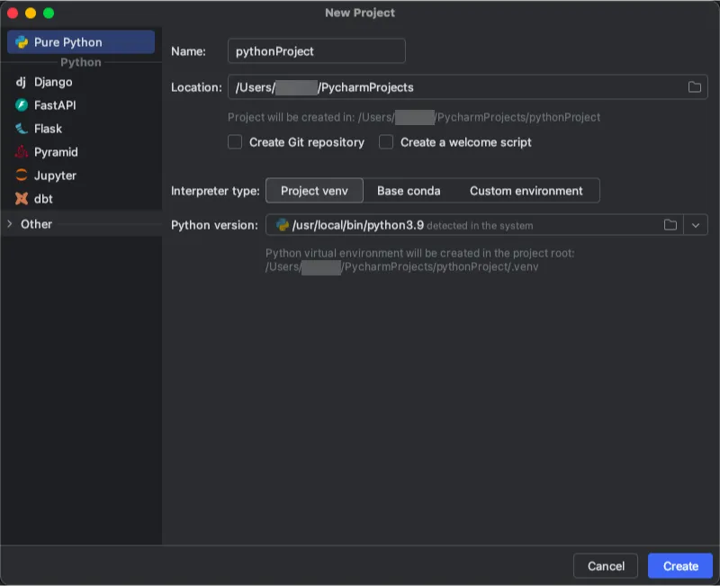

Right-click on the project folder and create a new Python file.


Name the Python file, for example `Test`.


Write a simple command in the file.

```
Python print("Hello world!")
```


# **Set Up a Remote Connection**

## **1. Set up the Python Interpreter**

For Windows users, click `File-Settings` in the top-left corner.

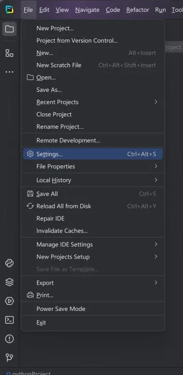

For Mac users, click `PyCharm-Preferences`.

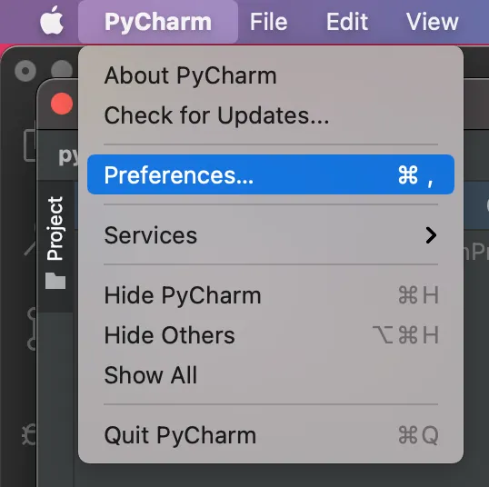

## **Pycharm 2024**

If you use PyCharm 2024 or a later version, follow these steps: click Project:pythonProject — Python Interpreter, then click `Add Interpreter -> On SSH` to add a new remote interpreter.


Enter the following details of the rented machine: Host, Port, Username, and password.

- Host: Use the domain name provided in your SSH.
- Port: The number after `P`in the SSH connection details on Glows.ai, in this example `23470`, it is usually a five-digit number.
- Username: `root`


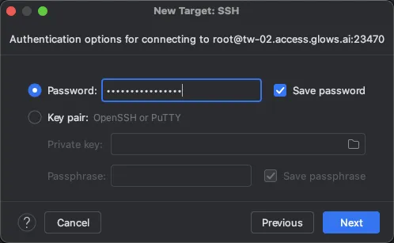

Click `Next` in the following steps. On the page of interpreter selection section, select `System Interpreter`, and enter the Python interpreter of your rented machine. The default interpreter path is:

`*/root/miniconda3/envs/workenv/bin/python*`

If you have created your own Conda environment, replace it with the corresponding environment path.

Please note that you also need to modify the folder path. Glows.ai recommends that you change it to the `/datadrive`directory.

Click `Create` to complete adding remote interpreter.


In this step, click `Apply` to start synchronization.

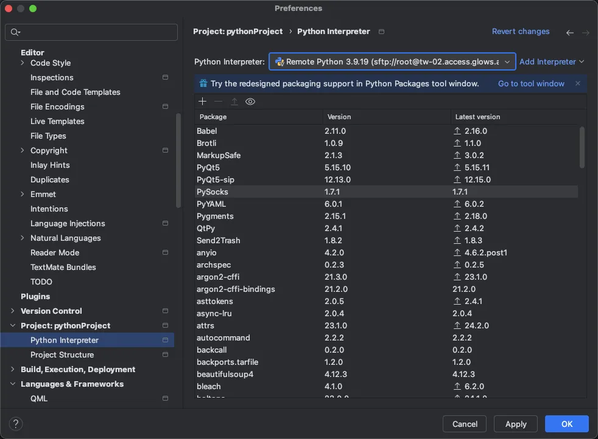

## **2. Run the code**

After synchronization is complete, right-click the file name, and click`Run` to execute the file.

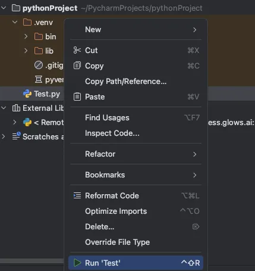

You can see the results below.


## **3. Install other Python packages**

How do you install missing packages when PyCharm is connected to the server but you encounter missing packages while running the code?

- You can first ensure that the selected Python interpreter is correct. If you are using the default system environment, the default interpreter path should be `*/root/miniconda3/envs/workenv/bin/python.*`
- If you have set up your environment, select the corresponding interpreter when connecting to the server.
- In PyCharm, click `Tools->Start SSH Session`. After connecting, run `pip install package_name` in the terminal. If the remote environment includes the package, but PyCharm shows a red wavy line indicating it is not installed, you can ignore this warning. You can run the code directly. This may be because PyCharm is still synchronizing and mapping the newly installed packages to the remote interpreter.

## **4. File Synchronization Configuration**

Generally, after setting up the Python interpreter, file synchronization is automatically configured.

If not, you can click `Tools->Deployment->Configuration` to set up.

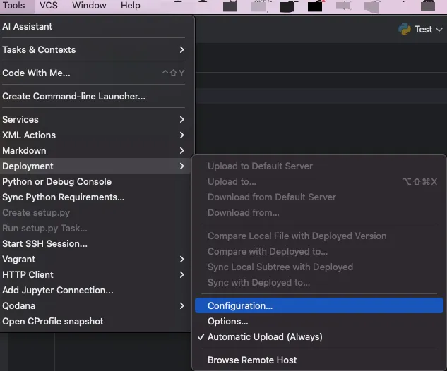

Modify `Host` and `Port`to match the hostname and port number of your rented machine. Keep `Root Path`empty, do not auto-fill it, as it may lead to synchronization errors.

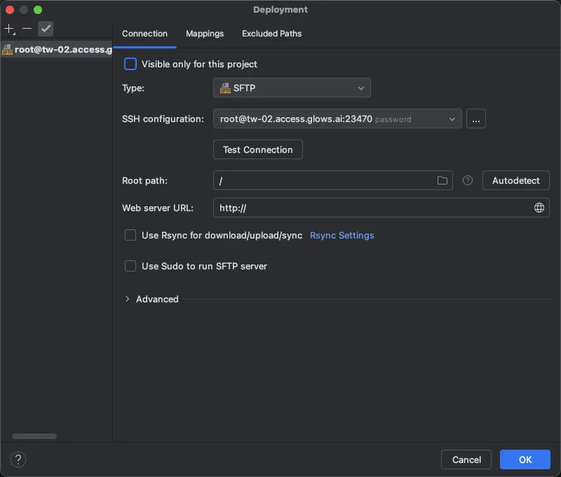


To avoid confusion, you can rename this connection to Glows.ai for easier use. Right-click on the listed name on the left, select `Rename`, and change it to Glows.ai.

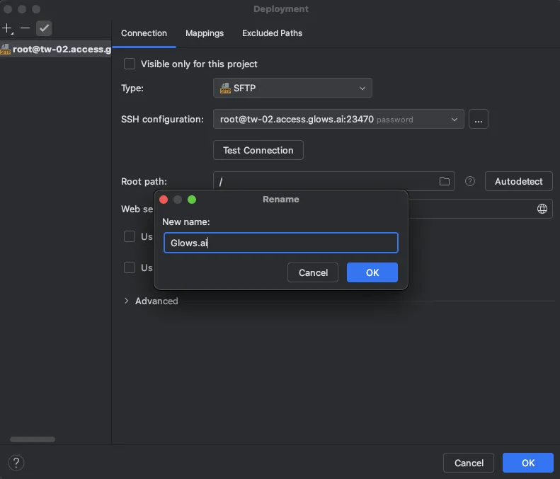

## **5. Upload/Download Files**

By default, PyCharm automatically syncs all files in the locally opened project to the remote server. You can see the file transfer status in `File Transfer` below, indicating that the files have already been synced to the server directory.

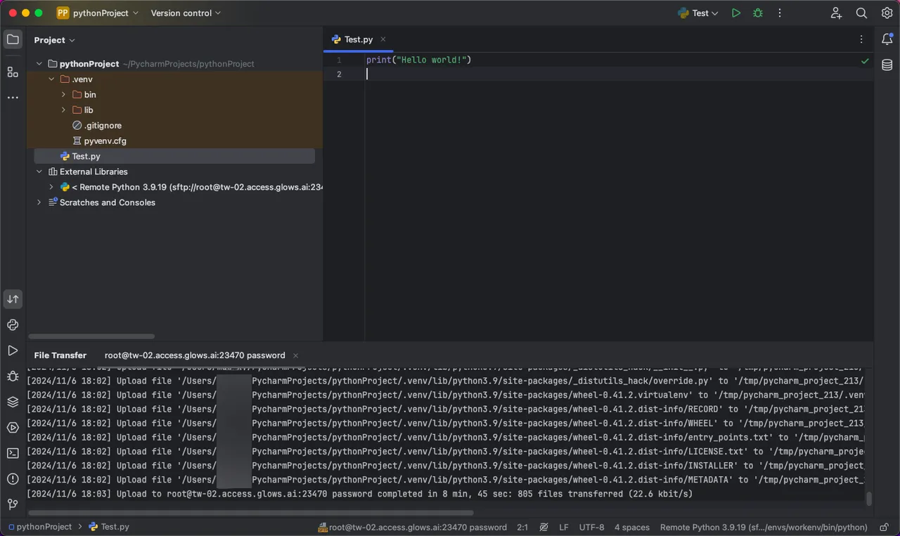

If automatic synchronization doesn’t occur, you can manually sync the files.

Select the files that need to be synced, right-click, then choose `Deployment->Upload to xxx`. Similarly, when remote files are modified or new files/results are generated, you can select the folder, right-click, then choose `Deployment->Upload to xxx` to sync the remote files to your local environment.


# **Use Remote Terminal**

If you want to execute bash commands remotely in PyCharm, you can use `Terminal`tool in PyCharm. The terminal is connected locally by default. You can click `Tools->Start SSH Session` to connect to the remote server.

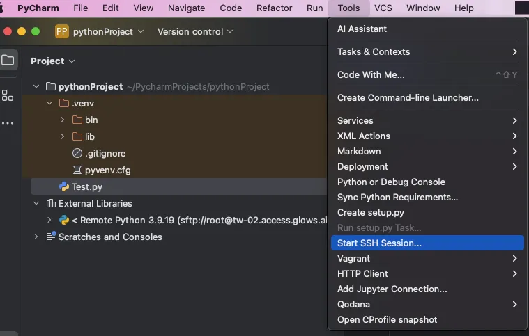

Select Glow.ai host to connect

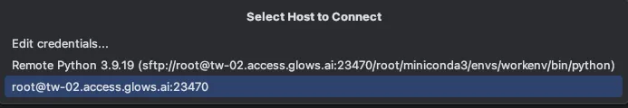

After selecting, PyCharm will create a new `Terminal` at the bottom connected to your machine on Glows.ai, where you can run bash commands.


Ready to get started? Visit [Glows.ai](https://glows.ai/) now and unlock the power of remote GPU computing!

Learn more about us:

- **Website**: [https://glows.ai](https://glows.ai/)
- **Discord**: [https://discord.gg/glowsai](https://discord.gg/glowsai)
