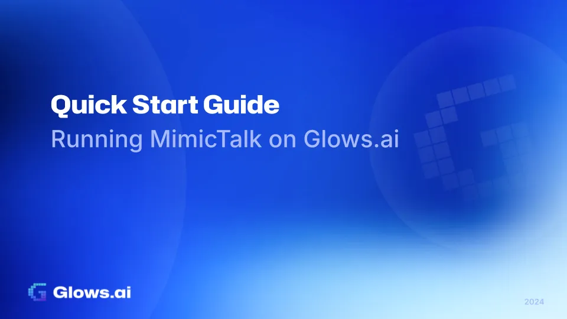
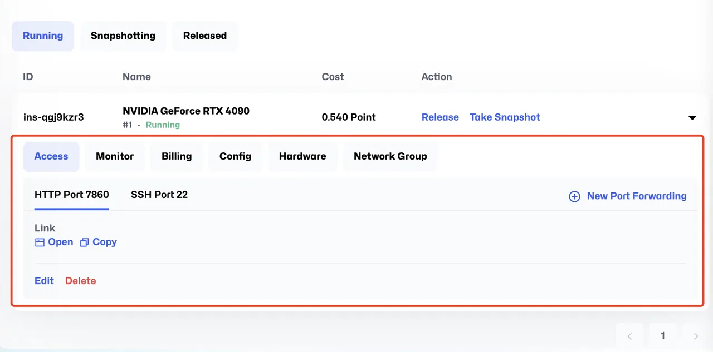
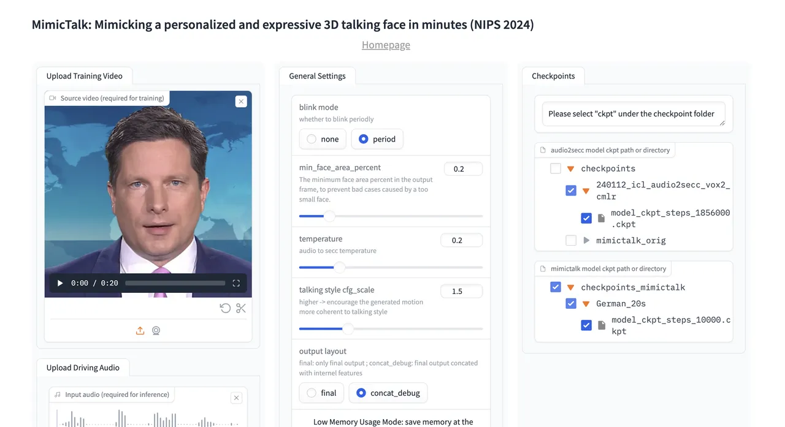

**MimicTalk** is a powerful text-to-speech (TTS) tool designed to generate natural, lifelike speech. Leveraging cutting-edge TTS technology, MimicTalk supports multiple languages, tones, and extensive customization options, making it ideal for virtual assistants, content creation, and educational applications.

With **Glows.ai**, you can easily run MimicTalk in a high-performance cloud environment, eliminating the need for complex installations and configurations. This guide walks you through setting up and accessing MimicTalk with multiple connection options (HTTP and SSH).

# **Step-by-Step Instructions**

## **Step 1: Log in to Glows.ai and Launch the MimicTalk Environment**

1. **Sign up and log in** Visit [Glows.ai](https://glows.ai/), register for an account, and log in.
2. **Launch the MimicTalk environment** On the dashboard, locate the **MimicTalk** task template and click “Complete Checkout.” Glows.ai will automatically allocate resources and set up dependencies for you.

## **Step 2: Access the MimicTalk Environment**

Once the environment is launched, you can access it using the following methods:

**1. HTTP WebUI (Port 7860)**

This is the main MimicTalk web interface for generating speech.

- Open the URL:
- plaintext
- [`https://tw-03.access.glows.ai:24527?token=iOuz4vDMME`](https://tw-03.access.glows.ai:24527/?token=iOuz4vDMME)
- The interface is user-friendly and allows you to input text and adjust voice parameters easily.

**2. SSH Access (Port 22)**

SSH provides command-line access to the backend environment for advanced operations.

- SSH Command:
- `ssh user@<your-instance> -p 22`
- **Password**: Refer to the instance details in your Glows.ai dashboard.

## **Step 3: Generate Speech with MimicTalk**

1. **Generate Speech Using the WebUI**

(1)Open the WebUI.

(2)Enter your desired text in the input box, for example:

(3)Plaintext `Hello, welcome to MimicTalk on Glows.ai!`

(4)Adjust parameters such as tone, speed, and voice style.

(5)Click **Generate** to produce the speech, which you can then preview or download.

**2. Generate Speech Using the WebUI**

(a)SSH into the container

(b)Set environmental variables

(c)Check and close existing processes

(d) processesParameter Configuration：Modify train_once_args parameters:

`*vim /root/MimicTalk/inference/app_mimictalk.py*`

(e)Change key parameters

`*torso_ckpt: from 'checkpoints/mimictalk_orig/os_secc2plane_torso/' to 'checkpoints_mimictalk/<VIDEO_NAME>/'*`

_max_updates: from 10000 to 2000_

(f)File Configuration Copy parameter files

`*cp -r /root/MimicTalk/checkpoints_mimictalk/German_20s /root/MimicTalk/checkpoints_mimictalk/<VIDEO_NAME>*`

(g)Service Launch：Choose one of the following methods to start:

(h)Direct launch:

`*cd /root/MimicTalk*`

`*python inference/app_mimictalk.py --share --server 0.0.0.0*`

(i)Background execution

`*nohup python inference/app_mimictalk.py --share --server 0.0.0.0 &*`

## **Step 4: Save and Export Outputs**

1. **Download Files from the WebUI** Use the **Download** button in the MimicTalk WebUI to save the generated audio files directly to your local device.
2. **Manage Files via SSH** Transfer files from the server to your local machine using SCP (Secure Copy):`*scp -P 22 user@<your-instance>:~/output.wav ./output.wav*`
3. **Output path:** `infer_out/tmp/demo.mp4`

# **Troubleshooting**

**Service Launch Failures**

1. Check port occupancy
2. Review system logs
3. Verify environment variable settings

**Training Failures**

1. Check training data format
2. Verify checkpoint configurations
3. Review error logs

# **Support and Resources**

# **Technical Support**

1. Contact [Glows.ai support team](https://discord.gg/DFhTBX7t)
2. Review [Official Documentation](https://github.com/yerfor/MimicTalk)
3. Check community forums

# **Additional Resources**

1. MimicTalk documentation
2. Glows.ai platform guides
3. Training tutorials

# **Why MimicTalk on Glows.ai?**

1. **Hassle-free setup**: Pre-configured environments let you start quickly.
2. **High-performance computing**: Enjoy smooth and high-quality speech synthesis.
3. **Multiple access points**: HTTP WebUI and SSH provide flexibility for different user needs.
4. **Customizable workflows**: Generate speech with different languages, tones, and styles.

# **Get Started with MimicTalk Today!**

Whether you’re a content creator, developer, or educator, **MimicTalk** is the perfect tool for high-quality speech synthesis. Start your journey by visiting Glows.ai today!

For additional support, contact the Glows.ai team or refer to the official documentation.

Learn more about us:

- **Website**: [https://glows.ai](https://glows.ai/)
- **Discord**: [https://discord.gg/glowsai](https://discord.gg/glowsai)
